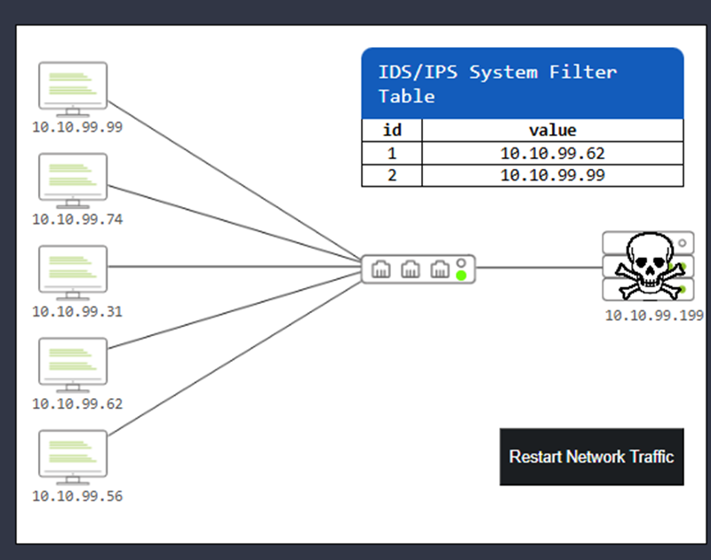
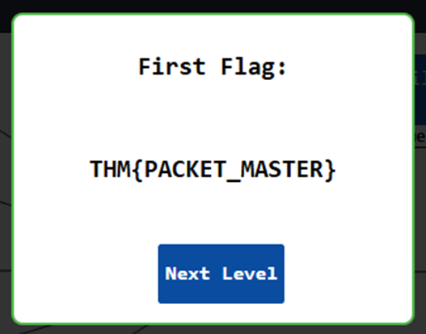
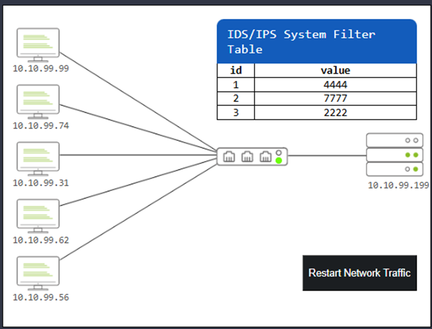
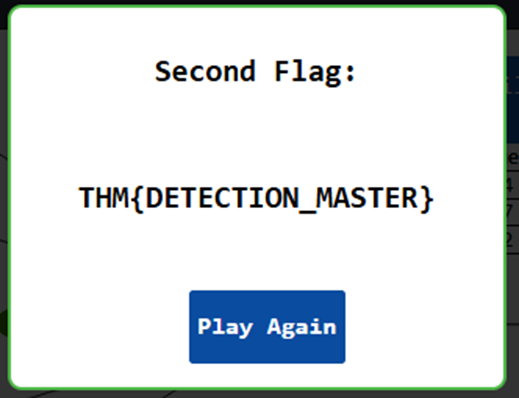

## 1. Summary
The Intrusion Detection/Prevention System (IDS/IPS) detected multiple anomalies and malicious traffic signatures within the corporate network. Through traffic log analysis (Traffic Analyser), the presence of an external threat actor interacting with several internal assets was confirmed. Containment measures were applied in two phases to isolate the threat and ensure business continuity.

## 2. Findings (What Was Discovered)
Data correlation between IDS alerts and network flow analysis revealed the following Indicators of Compromise (IoCs):

* **Compromised Internal Assets:**
  * `10.10.99.99`: Showed multiple login attempts and outbound traffic associated with the Metasploit exploitation framework.
  * `10.10.99.62`: Logged non-standard malicious traffic signatures ("Bad Traffic").
  * `10.10.99.74`: Exhibited anomalous Address Resolution Protocol behavior ("Suspicious ARP Behaviour").
* **Communication Vectors (Malicious Ports):** The attacker used specific destination ports, commonly associated with backdoors and evasion:
  * **Port 4444:** Reverse shell traffic (Metasploit).
  * **Port 7777:** Traffic associated with trojans.
  * **Port 2222:** Covert remote administration traffic.

## 3. Containment and Mitigation Actions (What Was Done)
To neutralize the ongoing attack, filtering rules were applied to the perimeter Firewall at two strategic levels:

### Phase 1: Network-Level Isolation (IP Blocking)
* All incoming and outgoing traffic to the hostile IP `10.10.99.62` was explicitly blocked.
* The internal machine `10.10.99.99` was temporarily isolated to prevent the malware's lateral movement within the corporate network.

### Phase 2: Granular Application-Level Filtering (Port Blocking)
* To avoid disrupting the legitimate operations of other machines during the investigation, the response transitioned to a surgical block. Traffic to destination ports **4444, 7777, and 2222** was denied. This short-circuited the attacker's communication channels (backdoors) without the need to completely isolate the affected machines.

---

